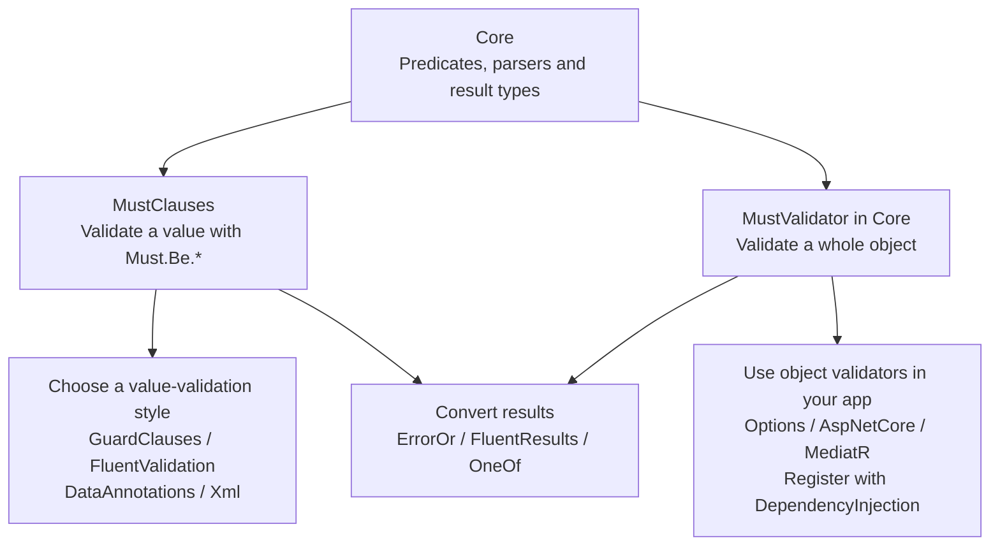
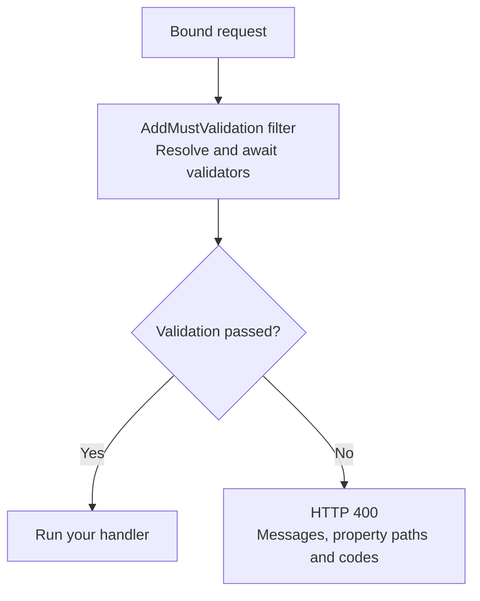
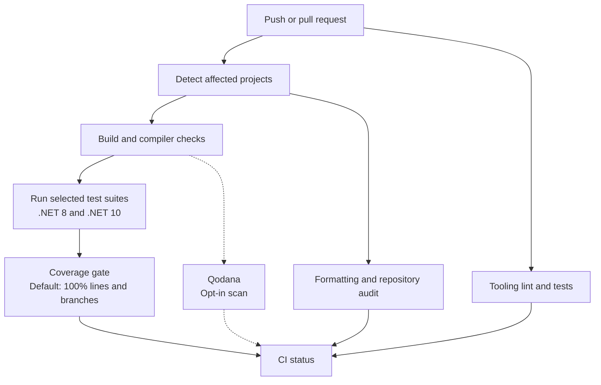

<p align="center">
  <a href="https://github.com/stevomccormack/PineGuard">
    
  </a>
</p>

<h1 align="center">PineGuard</h1>

<p align="center">
  <strong>Validation that thinks like you do.</strong><br />
  One rule library. Every call site. Every seam in your .NET architecture.
</p>

<p align="center">
  <a href="https://www.nuget.org/packages/PineGuard.Core"></a>
  <a href="https://www.nuget.org/packages/PineGuard.Core"></a>
  <a href="https://github.com/stevomccormack/PineGuard/actions/workflows/ci.yml"></a>
  <a href="LICENSE"></a>
</p>

<p align="center">
  <a href="#quality-metrics"></a>
  <a href="#quality-metrics"></a>
  <a href="SECURITY.md"></a>
  
</p>

```csharp
using PineGuard.GuardClauses;
using PineGuard.MustClauses;

var email    = Guard.Against.NotEmail(input);    // throws on bad input, hands the value back
var result   = Must.Be.Email(input);             // validation failure becomes a result with a stable code
var callback = Guard.Against.NotHttpsUrl(url);   // returns a parsed Uri, not the string you passed in
```

**Fifteen packages, one validation engine.** Result-based validation, fail-fast guards, FluentValidation
extensions, DataAnnotations, and integrations for the rest of your .NET application. The CI matrix covers
15 test projects on .NET 8 and .NET 10, with a default **100% line and branch coverage** gate.
See [quality metrics](#quality-metrics) for evidence, scan snapshots, and checks still to be added.

> **Release status:** PineGuard is pre-1.0. This README describes the current source tree; the
> [package table](#packages) distinguishes published alpha packages from integrations available in source.

---

## Contents

- [Why PineGuard](#why-pineguard)
- [Quick start](#quick-start)
- [Quality metrics](#quality-metrics)
- [Follow one rule](#follow-one-rule), a ten-stop tour of one email address:
  [Ask it](#1-ask-it-must) · [Enforce it](#2-enforce-it-guard) · [Declare it](#3-declare-it-fluentvalidation-and-dataannotations) · [Compose it](#4-compose-it-mustvalidatort) · [Boot with it](#5-boot-with-it-options) · [Serve it](#6-serve-it-aspnet-core) · [Dispatch it](#7-dispatch-it-mediatr) · [Return it](#8-return-it-erroror-fluentresults-oneof) · [Let the compiler write it](#9-let-the-compiler-write-it-analyzers) · [Test it](#10-test-it-pineguardtesting)
- [Every failure has a name](#every-failure-has-a-name)
- [What's in the box](#whats-in-the-box)
- [Packages](#packages) · [Target frameworks](#target-frameworks)
- [Where PineGuard fits](#where-pineguard-fits)
- [Built by AI. Verified like it matters.](#built-by-ai-verified-like-it-matters)
- [Documentation](#documentation) · [Contributing](#contributing) · [Security](#security) · [License](#license)

---

## Why PineGuard

Every .NET codebase validates the same email address in five dialects. A guard in the constructor. A
`Must()` lambda in a FluentValidation class. A `[RegularExpression]` on the DTO. A hand-written check in
the options binder. A forty-line `IPipelineBehavior` that someone copied from the last project. Five
places, five spellings, and when the rule changes, four of them drift.

PineGuard fixes the root cause. **Validation logic lives in one core**, with no third-party dependencies,
and is surfaced as a result, as a guard, as a FluentValidation rule, as an attribute, at
host startup, in the request pipeline, in the mediator, and inside your result types.

- **One mental model.** Learn `Must.Be.Email` and you already know `Guard.Against.NotEmail`,
  `RuleFor(x => x.Email).Email()` and `[Email]`. Same rule, same message, same code.
- **Breadth you stop wishing for.** Strings, numbers, decimals, dates and ranges, collections,
  dictionaries, URIs, emails, phone numbers, IPs and CIDR blocks, MAC addresses, JWTs, ULIDs, SemVer, cron
  expressions, Luhn checksums, file signatures, Unicode graphemes, JSON, XML, CSV, HTTP security headers,
  and OWASP-safe input.
- **Your exceptions, your results.** Guards throw whatever your domain speaks. Results cross into ErrorOr,
  FluentResults and OneOf with the rule code intact.
- **A name on every failure.** Each rule carries a stable machine-readable code, so a client, a log, or a
  localiser can branch on *what* failed without parsing prose.

The architecture below shows how the rule engine serves application code. Arrows show reuse; this is
an overview, not a complete project-reference graph.



`PineGuard.Analyzers` adds editor diagnostics and code fixes; `PineGuard.Testing` supplies reusable
fixtures and test helpers across these surfaces.

---

## Quick start

For a .NET 8 or .NET 10 application, install the published alpha packages:

```bash
dotnet add package PineGuard.MustClauses --prerelease
dotnet add package PineGuard.GuardClauses --prerelease
```

```csharp
using PineGuard.GuardClauses;
using PineGuard.MustClauses;

var email = "alice@example.com";

// Ask: a result you inspect
var result = Must.Be.Email(email);
if (result.Failed)
{
    Console.WriteLine(result.Message);
    return;
}

// Enforce: an exception at the boundary, the validated value on the way out
var sender = Guard.Against.NotEmail(email);
Console.WriteLine(sender);
```

Use Must when the caller should handle a validation failure, and Guard when a failure should throw.
The examples below illustrate the source-tree APIs; their application-specific models and services
belong to your application. See [package availability](#packages) before choosing an integration.
Stable failure codes, object validators and the newer integrations shown in the tour are source-tree
features and are not included in the published `0.1.0-alpha.7` packages.

---

## Follow one rule

> **The story of this README is one rule.** Watch an email address travel from a constructor to an HTTP
> 400, and on into your tests, without ever being spelled twice.

### 1. Ask it: Must

**Validation that returns an answer, not an exception.** `Must.Be.*` hands back a `MustResult<T>`: inspect
it, compose it, or escalate it when *you* decide to.

```csharp
using PineGuard.MustClauses;

var result = Must.Be.Email(email);
if (result.Failed)
    return BadRequest(new { result.Code, result.Message });   // "email.address.invalid"

// Escalate only when you choose to
var callback = Must.Be.HttpsUrl(callbackUrl).OrThrow();       // a parsed Uri, or an exception

// Compose: later steps run only if earlier ones pass
var orderId = Must.Be.NotNull(id).AndThen(v => Must.Be.Guid(v));

// Several values, one answer
var checks = MustValidationResult.From(
    Must.Be.Email(email),
    Must.Be.Hostname(host),
    Must.Be.PortNumber(port));
```

Clauses come in pairs (`Must.Be.Empty` / `Must.Be.NotEmpty`, `Must.Be.Hostname` / `Must.Be.NotHostname`),
every result converts to `bool`, and validation failures are returned as results. Exceptions from your
custom predicates still propagate; `OrThrow()` explicitly converts a failed result into an exception.

> **Same rule, next stop:** the constructor.

### 2. Enforce it: Guard

**Stop bad input at the door. Keep the parsed value. Throw *your* exception.** A guard names the forbidden
state, throws if it sees it, and returns the validated value so the happy path never re-parses.

```csharp
using PineGuard.GuardClauses;

public sealed class Webhook
{
    public Webhook(string email, string callbackUrl, string hostname, string routeSegment)
    {
        Email    = Guard.Against.NotEmail(email);            // string in, validated string out
        Callback = Guard.Against.NotHttpsUrl(callbackUrl);   // string in, parsed Uri out
        Host     = Guard.Against.NotHostname(hostname);      // domain only, e.g. api.example.com
        RouteSegment = Guard.Against.OwaspUnsafe(routeSegment); // pattern checks for identifier-like input
    }

    public string Email { get; }
    public Uri Callback { get; }
    public string Host { get; }
    public string RouteSegment { get; }
}
```

Choose an exception policy for the application, a scope, or a single call.

```csharp
using PineGuard.Codes;
using PineGuard.GuardClauses;

// App-wide: every guard in the process throws your exception. Call once at the composition root.
GuardExceptionPolicy.Map(failure => failure.Code switch
{
    var c when c.StartsWith(MustCodes.Owasp.Prefix + '.', StringComparison.Ordinal)
        => new SecurityViolationException(c, failure.Exception),
    _   => new DomainValidationException(failure.Code, failure.Message, failure.Exception),
});

// Scoped: this checkout speaks CheckoutException; the map is restored on dispose
using (GuardExceptionPolicy.BeginScope(f => new CheckoutException(f.Message, f.Exception)))
{
    Guard.Against.Null(order);
    Guard.Against.OutOfRange(order.Quantity, 1, 100);
}

// Per call: this one invocation, nothing else
Guard.Against.Null(order, exceptionCreator: () => new CheckoutException("An order is required."));
```

Guards keep their rule code too: `ex.TryGetMustCode(out var code)` reads it back off any exception a guard
threw, mapped or not.

> **Same rule, next stop:** the validator class you already have.

### 3. Declare it: FluentValidation and DataAnnotations

**Keep the DSL you like. Get the rules you were missing.** PineGuard extends FluentValidation's rule
builder with 770+ methods and ships 390+ attributes for DataAnnotations. Nothing to replace, nothing to
migrate.

```csharp
using FluentValidation;
using PineGuard.FluentValidation;

public sealed class RegisterWebhookValidator : AbstractValidator<RegisterWebhook>
{
    public RegisterWebhookValidator()
    {
        RuleFor(x => x.Email).Required().Email();
        RuleFor(x => x.CallbackUrl).Required().HttpsUrl();
        RuleFor(x => x.Hostname).Hostname();
        RuleFor(x => x.RouteSegment).OwaspSafe();
        RuleFor(x => x.DateOfBirth).MinimumAge(18);
    }
}
```

```csharp
using PineGuard.DataAnnotations;

public sealed class RegisterWebhook
{
    [NotNull, Email]     public string? Email { get; init; }
    [NotNull, HttpsUrl]  public string? CallbackUrl { get; init; }
    [Hostname]           public string? Hostname { get; init; }
    [OwaspSafe]          public string? RouteSegment { get; init; }
    [MinimumAge(18)]     public DateOnly DateOfBirth { get; init; }
}
```

Format attributes allow `null` by default, exactly like the built-in ones, so pair them with `[NotNull]`
when a value must be present. FluentValidation uses `Required()` / `NotRequired()` for presence to stay
clear of its own `NotNull()`.

> **Same rule, next stop:** the whole object, every failure, in one pass.

### 4. Compose it: `MustValidator<T>`

**One validator, every failure, each with a property path.** Cross-property rules, conditions, nested
validators, collection elements, and async rules, all returning a single `MustValidationResult`.

```csharp
using PineGuard.MustClauses;

public sealed record OrderLine(string? Sku, int Quantity);
public sealed record CreateOrder(string? Email, DateTime StartDate, DateTime EndDate,
                                 bool IsPhysical, decimal Weight, IReadOnlyList<OrderLine>? Lines);

public sealed class OrderLineValidator : MustValidator<OrderLine>
{
    public OrderLineValidator()
    {
        RuleFor(x => x.Sku, sku => Must.Be.NotNullOrWhiteSpace(sku));
        RuleFor(x => x.Quantity, qty => Must.Be.Positive(qty));
    }
}

public sealed class CreateOrderValidator : MustValidator<CreateOrder>
{
    public CreateOrderValidator(IUserDirectory users)
    {
        RuleFor(x => x.Email, email => Must.Be.Email(email));
        RuleFor(x => x.EndDate, (order, end) => Must.Be.After(end, order.StartDate));      // cross-property
        RuleFor(x => x.Weight, weight => Must.Be.Positive(weight)).When(x => x.IsPhysical); // conditional
        RuleFor(x => x.Lines, lines => Must.Be.NotEmpty(lines));
        RuleForEach(x => x.Lines, new OrderLineValidator());                                // nested, per element
        RuleForAsync(x => x.Email, (e, ct) => Must.Be.SatisfiesAsync(e, users.IsAvailableAsync, ct)); // async
    }
}
```

Call the validator from your application:

```csharp
var result = await new CreateOrderValidator(users).ValidateAsync(order);
foreach (var failure in result.Failures)
    Console.WriteLine($"{failure.PropertyPath}: {failure.Message} [{failure.Code}]");

// Email: Email must be a valid email address. [email.address.invalid]
// EndDate: EndDate must be after the specified date/time. [date.order.not-after]
// Lines[1].Sku: Sku must not be null or whitespace. [text.content.blank]
```

Call `result.ThrowIfFailed()` to throw a `MustValidationException` containing every failure. For
synchronous validators, `Guard.Against.Invalid(value, validator)` throws a guard exception for the first
failure. Inside FluentValidation, use `SetMustValidator(...)` and `MustBe(...)` to add a PineGuard
validator or clause to a rule chain.

> **Same rule, next stop:** `appsettings.json`.

### 5. Boot with it: Options

**Configuration that refuses to start wrong.** `ValidateDataAnnotations()` gives you `[Required]`.
`ValidateMustRules()` gives you the whole vocabulary, and `ValidateOnStart()` lists *every* violation in
one exception instead of the first one an operator trips over.

```csharp
using PineGuard.Extensions.Options;
using PineGuard.MustClauses;

public sealed class SmtpOptionsValidator : MustValidator<SmtpOptions>
{
    public SmtpOptionsValidator()
    {
        RuleFor(o => o.Host, host => Must.Be.Hostname(host));
        RuleFor(o => o.Port, port => Must.Be.PortNumber(port));
        RuleFor(o => o.From, from => Must.Be.Email(from));
        RuleFor(o => o.Port, port => Must.Be.EqualTo(port, 465)).When(o => o.UseTls);
    }
}
```

Register the validator and options at startup:

```csharp
builder.Services.AddSingleton<IMustValidator<SmtpOptions>, SmtpOptionsValidator>();
builder.Services.AddOptions<SmtpOptions>()
    .BindConfiguration("Smtp")
    .ValidateMustRules()
    .ValidateOnStart();
```

```text
OptionsValidationException: SmtpOptions.Host: Host must be a valid hostname. [network.hostname.invalid];
SmtpOptions.From: From must be a valid email address. [email.address.invalid]
```

> **Same rule, next stop:** the HTTP boundary.

### 6. Serve it: ASP.NET Core

**One bad request, one 400, every failure listed, a stable code on each.** Minimal API and MVC
auto-validation runs *after* binding and *before* your handler, and answers with RFC 9457
`ValidationProblemDetails` keyed the way your JSON is spelled.

```csharp
using PineGuard.AspNetCore;

builder.Services.AddProblemDetails();                          // fallback for unhandled application errors
builder.Services.AddMustValidation(typeof(Program).Assembly);   // scans for every IMustValidator<T>
builder.Services.AddControllers().AddMustValidation();          // MVC: same body, ModelState populated too

app.UseExceptionHandler();                                      // MustValidationException becomes the same 400
app.MapPost("/orders", (CreateOrder order) => TypedResults.Ok(order))
   .AddMustValidation();                                        // or app.MapGroup("/api").AddMustValidation()
```

```json
{
  "type": "https://tools.ietf.org/html/rfc9110#section-15.5.1",
  "title": "One or more validation errors occurred.",
  "status": 400,
  "errors": {
    "email": ["email must be a valid email address."],
    "endDate": ["endDate must be after the specified date/time."]
  },
  "failures": [
    { "property": "email", "code": "email.address.invalid", "message": "email must be a valid email address." },
    { "property": "endDate", "code": "date.order.not-after", "message": "endDate must be after the specified date/time." }
  ]
}
```



Guard exceptions stay 500s by default, because a guard three layers deep is a bug in your code, not a bad
request. On .NET 10, `AddValidation(o => o.AddMustValidatorResolver())` plugs the same validators into the
built-in `Microsoft.Extensions.Validation` pipeline. Attempted values are omitted from the response.

> **Same rule, next stop:** the mediator.

### 7. Dispatch it: MediatR

**Delete the forty-line validation behavior every MediatR codebase re-writes.** One line registers a
pipeline behavior that runs every validator for a request, merges the results, and either throws or
returns the failure response you define.

```csharp
using PineGuard.Extensions.DependencyInjection;
using PineGuard.MediatR;

builder.Services.AddMustValidatorsFromAssemblyContaining<Program>();
builder.Services.AddMediatR(cfg =>
{
    cfg.RegisterServicesFromAssemblyContaining<Program>();
    cfg.AddMustValidation();     // requests without a validator pass through
});
```

Register an `IMustFailureResponseFactory<TResponse>` and the behavior returns your failure type instead
of throwing.

> **Same rule, next stop:** your result type.

### 8. Return it: ErrorOr, FluentResults, OneOf

**Your validation result, spelled the way your domain already speaks.** One extension method crosses
over, and the rule code, message and property path travel with it.

```csharp
using ErrorOr;
using FluentResults;
using OneOf;
using PineGuard.ErrorOr;
using PineGuard.FluentResults;
using PineGuard.MustClauses;
using PineGuard.OneOf;

var input = "alice@example.com";
ErrorOr<string>            a = Must.Be.Email(input).ToErrorOr();   // Error.Validation("email.address.invalid", ...)
Result<string>             b = Must.Be.Email(input).ToResult();    // FluentResults: fails with a MustError
OneOf<string, MustFailure> c = Must.Be.Email(input).ToOneOf();     // match on the value or the failure

var orderLine = new OrderLine("SKU-001", 2);
ErrorOr<OrderLine> line = new OrderLineValidator().Validate(orderLine).ToErrorOr(orderLine);
```

> **Same rule, next stop:** the code you have not written yet.

### 9. Let the compiler write it: Analyzers

**Your editor already knows that `if (x is null) throw` is a guard clause. Now it can write one.** Six
diagnostics, each with a code fix and fix-all across a solution, shipped as a development dependency that
never reaches your published output.

```csharp
// Before
if (name is null)
    throw new ArgumentNullException(nameof(name));

if (quantity < 1 || quantity > 100)
    throw new ArgumentOutOfRangeException(nameof(quantity));

// After applying the code fixes
Guard.Against.Null(name);
Guard.Against.OutOfRange(quantity, 1, 100);

Must.Be.NotNull(name);            // PG2001: result discarded, nothing was checked
```

| Id | Fires on | Severity |
|---|---|---|
| `PG1001` to `PG1004` | hand-rolled null, null-or-whitespace, null-or-empty and range checks | Info |
| `PG2001` / `PG2002` | a `MustResult` or `MustValidationResult` that nothing reads | Warning |

> **Same rule, last stop:** your own test suite.

### 10. Test it: PineGuard.Testing

**Test your validators the way PineGuard tests its own.** The base classes, case records and shared
valid/invalid fixture catalogue ship as a package, so your tests can reuse the same assertion helpers
and scenario data.

```csharp
using PineGuard.MustClauses;
using PineGuard.Testing.UnitTests.MustClauses;
using Xunit;
using Xunit.Abstractions;
using F = PineGuard.Testing.Fixtures.EmailRulesFixtures;

public sealed class EmailTests(ITestOutputHelper output) : BaseMustUnitTest(output)
{
    // The shipped email scenarios converted to theory data
    public static TheoryData<MustCase<string?>> Cases => F.IsEmail.AllScenarios.ToMustCases();

    [Theory, MemberData(nameof(Cases))]
    public void Email_BehavesAsExpected(MustCase<string?> tc)
    {
        var result = Must.Be.Email(tc.Value);
        AssertResult(tc, result);
    }
}
```

A `FixedTimeProvider` freezes the clock for every temporal rule, because "is this person 18" should not
depend on the day the test runs.

That is the whole tour: one rule, ten call sites, spelled once.

---

## Every failure has a name

Every failure, from a bare `Must.Be.*` call up through Guard, FluentValidation, ASP.NET Core and the
result bridges, carries a three-segment code next to its message: `<domain>.<aspect>.<condition>`.
Codes are stable across releases, safe to match as families, and typed as constants so a typo is a
compile error.

```csharp
using PineGuard.Codes;

if (failure.Code == MustCodes.Email.Address.Invalid) { /* ... */ }
if (failure.Code.StartsWith(MustCodes.Owasp.Prefix + '.', StringComparison.Ordinal)) { /* security, not a typo */ }
```

| Surface | The code reaches you as |
|---|---|
| `Must.Be.*` / `MustValidator<T>` | `MustResult<T>.Code`, `MustFailure.Code` |
| Guard | `GuardFailure.Code` inside `GuardExceptionPolicy.Map`; `exception.TryGetMustCode(...)` downstream |
| FluentValidation | `ValidationFailure.ErrorCode` |
| ASP.NET Core | the `failures[].code` array on the 400 body |
| ErrorOr / FluentResults / OneOf | `Error.Code`, `MustError.Code`, `MustFailure.Code` |
| DataAnnotations | `attribute.Code` on every attribute, and `DataAnnotationsAttributeValidator.Validate(model)` when you need a `MustValidationResult` with codes, because the framework's own `ValidationResult` has nowhere to carry one |

Localise by code through `IStringLocalizer` in ASP.NET Core, log by code, or branch by code in a client.
Nobody parses prose.

---

## What's in the box

Fifteen packages built on one rule engine. A sample of the `Must.Be.*` catalogue follows; each package
README documents the rules and overloads exposed by that surface.

```csharp
Must.Be.Email(value);                 Must.Be.StrictEmail(value);           Must.Be.PhoneNumber(value);
Must.Be.HttpsUrl(value);              Must.Be.Hostname(value);              Must.Be.PortNumber(port);
Must.Be.Ipv6(value);                  Must.Be.InCidrRange(ip, cidr);        Must.Be.MacAddress(value);
Must.Be.Jwt(token);                   Must.Be.Ulid(id);                     Must.Be.SemVer(version);
Must.Be.CronExpression(schedule);     Must.Be.Slug(value);                  Must.Be.Luhn(cardNumber);
Must.Be.Percentage(ratio);            Must.Be.ScaleAtMost(amount, 2);       Must.Be.InRange(qty, 1, 100);
Must.Be.MinimumAge(dob, 18);          Must.Be.WithinDaysFromNow(due, 30);   Must.Be.Weekday(date);
Must.Be.KnownFileSignature(bytes);    Must.Be.Utf8(bytes);                  Must.Be.WellFormedUtf16(text);
Must.Be.HasMinGraphemeCount(name, 2); Must.Be.KebabCase(value);             Must.Be.LengthBetween(value, 3, 64);
Must.Be.Json(payload);                Must.Be.Xml(document);                Must.Be.CsvLine(row);
Must.Be.XssSafe(input);               Must.Be.PathTraversalSafe(path);      Must.Be.OwaspSafe(input);
```

| Domain | Highlights |
|---|---|
| **Text** | length, casing styles, allowed characters, ASCII, control characters, BOM, UTF-8 and UTF-16 well-formedness, grapheme counts, Unicode normalization |
| **Numbers** | sign, range, parity, power of two, multiples, approximate equality, percentage, decimal precision and scale, bitwise flags |
| **Temporal** | `DateTime`, `DateTimeOffset`, `DateOnly`, `TimeOnly`, `TimeSpan`, ranges, overlap, calendar predicates, minimum age, SQL date ranges, all clock-injectable via `TimeProvider` |
| **Identifiers** | GUID and GUID version, ULID, slug, SemVer, JWT shape, cron expressions, MAC address, media types, regex validity |
| **Network and web** | email (pragmatic and strict), hostnames, IPv4/IPv6, CIDR ranges, ports, HTTP/HTTPS/relative/file URIs, HTTP status classes, header names and values, security headers (CSP, HSTS, X-Frame-Options, ...) |
| **Security** | OWASP composite plus XSS, SQL injection, command injection, LDAP filter, path traversal, open redirect, SSRF scheme, CRLF |
| **Files and data** | file paths, safe file names, extensions, magic-byte signatures, JSON, XML, CSV lines and rows |
| **Collections** | emptiness, counts, distinct and duplicate items, subsets, null items, dictionary keys and values |
| **Objects and enums** | null and default, type assignability, defined enum values and names, flags combinations, `[Description]` and `[Display]` metadata, obsolete members |
| **Tasks and predicates** | completed, faulted, canceled tasks; `Satisfies` and `SatisfiesAsync` for anything custom |

The [OWASP rules](src/PineGuard.Core/Rules/OwaspRules.cs) are pattern-based checks intended for
identifier-like fields. They can reject legitimate free text and do not replace parameterized queries
or context-appropriate output encoding.

---

## Packages

Catalogue sizes below are rounded-down counts of public source declarations for .NET 8 and .NET 10,
including overloads; they are not counts of distinct underlying validation rules.

| Package | What it adds |
|---|---|
| [`PineGuard.Core`](src/PineGuard.Core/README.md) | The rule engine: 350+ predicates, 120+ utility methods, `MustResult<T>`, `MustValidator<T>`, error codes. No third-party dependencies. |
| [`PineGuard.MustClauses`](src/PineGuard.MustClauses/README.md) | `Must.Be.*`: 600+ clauses that return validation failures as results |
| [`PineGuard.GuardClauses`](src/PineGuard.GuardClauses/README.md) | `Guard.Against.*`: 590+ fail-fast guard methods with parsed returns and the exception policy |
| [`PineGuard.FluentValidation`](src/PineGuard.FluentValidation/README.md) | 770+ `IRuleBuilder` extensions, plus bridges between the two validator models |
| [`PineGuard.DataAnnotations`](src/PineGuard.DataAnnotations/README.md) | 390+ `ValidationAttribute`s for DTOs, MVC binding and Blazor forms, plus a coded runner for the attributes |
| [`PineGuard.Xml`](src/PineGuard.Xml/README.md) | `Must.Be.ValidXml(payload, schemas)`: XSD conformance over a compiled schema set, every violation listed by element path |
| [`PineGuard.Extensions.Options`](src/PineGuard.Extensions.Options/README.md) | `ValidateMustRules()` for `IOptions<T>`; fail at host start with every violation listed |
| [`PineGuard.Extensions.DependencyInjection`](src/PineGuard.Extensions.DependencyInjection/README.md) | Register one validator or scan an assembly; resolve by `Type` at run time |
| [`PineGuard.AspNetCore`](src/PineGuard.AspNetCore/README.md) | Minimal API and MVC auto-validation, RFC 9457 bodies with codes, exception handler, .NET 10 validation resolver, localisation seam |
| [`PineGuard.MediatR`](src/PineGuard.MediatR/README.md) | `IPipelineBehavior` that validates every request, throw or respond |
| [`PineGuard.ErrorOr`](src/PineGuard.ErrorOr/README.md) | `ToErrorOr()`, `ToErrors()`: code, message and path onto `Error.Validation` |
| [`PineGuard.FluentResults`](src/PineGuard.FluentResults/README.md) | `ToResult()` with a `MustError` that carries the code |
| [`PineGuard.OneOf`](src/PineGuard.OneOf/README.md) | `ToOneOf()`: the value or PineGuard's own failure type, no exceptions |
| [`PineGuard.Analyzers`](src/PineGuard.Analyzers/README.md) | Roslyn analyzers and code fixes, `PG1001` to `PG2002`, a development dependency |
| [`PineGuard.Testing`](tests/PineGuard.Testing/README.md) | Base test classes, case records, fixture catalogue, `FixedTimeProvider` |

**Availability checked 25 September 2026:** Core, MustClauses, GuardClauses, FluentValidation,
DataAnnotations and Testing are published on [NuGet](https://www.nuget.org/profiles/stevomccormack) as
`0.1.0-alpha.7`. Xml and the eight integrations from Options through Analyzers are available in this
repository but are not yet published. Use project references or build local packages to try those
integrations. Package versions are derived from git tags via MinVer; source-tree APIs can be ahead of
the published alpha.

### Target frameworks

| Target | Packages |
|---|---|
| `netstandard2.1` | Runtime libraries except `PineGuard.AspNetCore` and `PineGuard.Testing` |
| `net8.0` | All runtime libraries, including `PineGuard.Testing` |
| `net10.0` | All runtime libraries; also enables the `Microsoft.Extensions.Validation` integration in `PineGuard.AspNetCore` |
| `netstandard2.0` | `PineGuard.Analyzers`, loaded by the compiler rather than the application |

`PineGuard.Analyzers` targets `netstandard2.0` and runs inside the compiler, not your app, so the project's
own target does not matter. It is built against Roslyn 5.9, so the build machine needs the compiler that
ships with the .NET 10 SDK (10.0.400 or newer).

Generic-math clauses such as `Must.Be.Positive<T>` need `INumber<T>` and therefore `net8.0` or later.
`PineGuard.Core` carries no third-party dependencies: only `System.Text.Json`,
`System.ComponentModel.Annotations`, and, on `netstandard2.1` alone, `Microsoft.Bcl.TimeProvider`.

---

## Where PineGuard fits

PineGuard amplifies what you already run. It does not ask you to leave it.

| You already use | PineGuard adds |
|---|---|
| **FluentValidation** | 770+ rule-builder extensions on the same `RuleFor(...)`; any Must clause drops in via `MustBe(...)`; validators cross both ways with `SetMustValidator(...)` and `FluentMustValidator<T>` |
| **Guard clauses** | the familiar `Guard.Against.X` shape, parsed return values, and your own exception via a global, scoped or per-call policy |
| **DataAnnotations** | 390+ attributes on top of the built-in handful, and `ToValidationResults()` to run a `MustValidator<T>` inside `IValidatableObject` |
| **Minimal APIs / MVC** | auto-validation after binding, one RFC 9457 body with codes, and the .NET 10 built-in validation pipeline |
| **MediatR** | the validation behavior, written once, with merge-every-failure semantics |
| **ErrorOr / FluentResults / OneOf** | one extension method per library; the code survives the crossing |
| **Options pattern** | `ValidateMustRules().ValidateOnStart()` with every violation in a single exception |

---

## Built by AI. Verified like it matters.

PineGuard is developed with AI agents working from the checked-in [engineering brain](docs/ai/README.md):
specifications, agent playbooks, reusable skills and adapters. The prescribed implementation order is
Core → Must → Guard → integrations, with tests for each layer. The source, test results and configured
checks are the evidence for the implementation.

### Quality metrics

Reviewed **25 September 2026**. Configured gates, measured results and missing checks are identified
separately below. The [CI badge](https://github.com/stevomccormack/PineGuard/actions/workflows/ci.yml)
reports live workflow status; the archived screenshots are historical snapshots.

| Metric or check | Status | Evidence and scope |
|---|---|---|
| Test matrix | **15 test projects × 2 target frameworks** | [CI workflow](.github/workflows/ci.yml) and [test targets](tests/Directory.Build.props): .NET 8 and .NET 10; affected suites on pull requests, all suites on `main` |
| .NET 10 tests | **18,887 passed / 18,887 executed** | [25 September 2026 local run](docs/reports/readme-verification-2026-09-25.md): 0 failed, 0 skipped |
| .NET 8 tests | **18,862 passed / 18,862 executed** | [25 September 2026 local run after reference-cache repair](docs/reports/readme-verification-2026-09-25.md): 0 failed, 0 skipped |
| Line coverage | **100% default CI threshold** | [Coverage job](.github/workflows/ci.yml); configurable through `MIN_CODE_COVERAGE` |
| Branch coverage | **100% default CI threshold** | Same threshold as line coverage; measured over the assemblies included in that run |
| Coverage snapshot | **100% lines / 100% branches** | [Archived report, 22 March 2026](docs/reports/code-coverage/pineguard-code-coverage-xplat-report.jpeg): 35,038 covered lines and 8,359 covered branches across the six assemblies then measured |
| Compiler and XML documentation | **Warnings treated as errors** | [Build settings](Directory.Build.props): recommended .NET analyzers, code style enforcement and public XML documentation; compiler warnings also checked in CI |
| Formatting | **CI check** | `dotnet format --verify-no-changes` in the [workflow](.github/workflows/ci.yml) |
| Repository conventions | **CI audit gate** | [Audit rules](apps/cli/src/audit/rules): document links, adapter parity, test/data file pairing and rejection of `[Fact]` tests |
| SonarQube | **Archived passing scan** | [20 March 2026 snapshot](docs/reports/code-scanner/pineguard-sonarqube-report.jpeg): 0 issues, 0 security hotspots, 0.0% duplication; not a job in the current CI workflow |
| Qodana | **Archived scan; opt-in CI job** | [21 March 2026 snapshot](docs/reports/code-analysis/pineguard-qodana-report--problems.jpeg): 0 problems across 3,194 inspections; CI runs it only when `QODANA_ENABLED=true` |
| Fuzz / property-based testing | **Not configured** | No dedicated fuzzing harness or property-based test suite in the current repository |
| Benchmarks | **Not provided** | No benchmark suite or published performance baseline in the current repository |
| Security policy | **Published** | [Private vulnerability reporting, supported versions and response targets](SECURITY.md) |
| Dependency updates | **Weekly updates configured** | [Dependabot](.github/dependabot.yml) for NuGet packages and GitHub Actions |
| API compatibility | **No automated gate yet** | No checked-in API baseline or cross-release compatibility check; multi-target builds do not establish compatibility between releases |
| Packaging | **Reproducible build settings** | [Deterministic builds, SourceLink and symbol packages](Directory.Build.props), [central package versions](Directory.Packages.props); the analyzer package omits symbols |

Coverage uses the repository's [Coverlet settings](tools/code-coverage/coverlet.runsettings), including
exclusions for generated code and coverage-excluded members. The archived coverage result predates the
expanded package set; it is not a measurement of today's checkout. Coverage and a green build do not
replace fuzzing, performance measurements or API compatibility checks.

The workflow runs these checks; repository branch-protection settings determine which checks are
required before merging. The diagram shows the main verification paths, not a promise that every job
runs for every change.



See [CONTRIBUTING.md](CONTRIBUTING.md) for local commands and contribution requirements.

---

## Documentation

Each package README above is the canonical guide for that surface. The engineering specs, conventions and
agent playbooks that built the library live in **[docs/ai](docs/ai/README.md)**; start there before
changing a convention.

## Contributing

See **[CONTRIBUTING.md](CONTRIBUTING.md)** for build, test and formatting instructions, and the quality
gates every pull request must clear on the first try
([CI workflow](https://github.com/stevomccormack/PineGuard/actions/workflows/ci.yml)).

## Security

Please do not open public issues for vulnerabilities. See **[SECURITY.md](SECURITY.md)**.

## License

MIT. See **[LICENSE](LICENSE)**.

<p align="center"><sub>One rule library. Every call site. Every seam.</sub></p>
