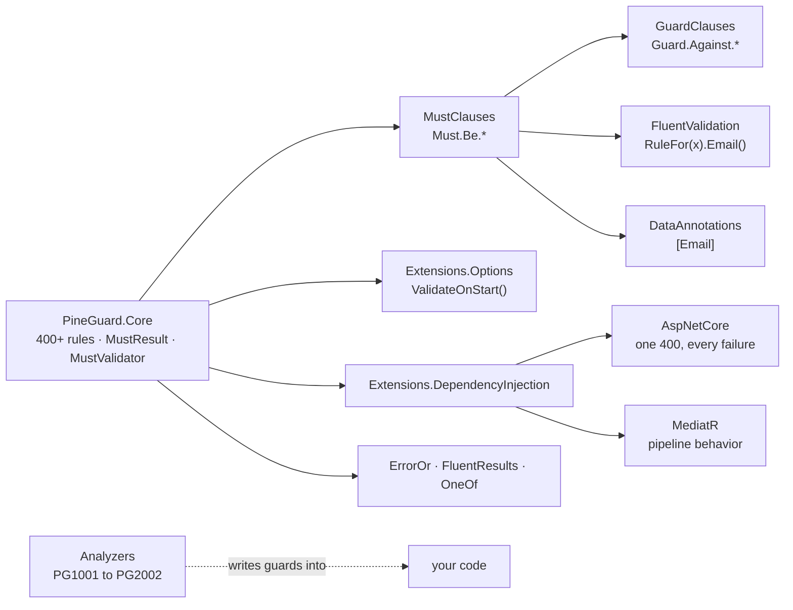
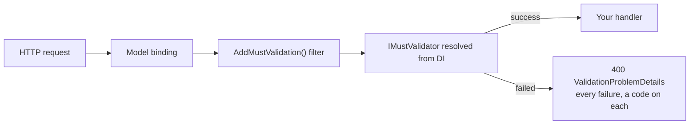
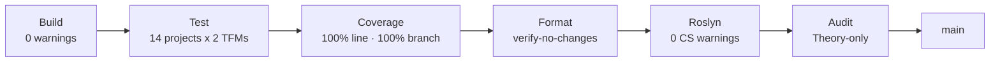

<p align="center">
  <a href="https://github.com/stevomccormack/PineGuard">
    
  </a>
</p>

<h1 align="center">PineGuard</h1>

<p align="center">
  <strong>Validation that thinks like you do.</strong><br />
  One rule library. Every call site. Every seam in your .NET architecture.
</p>

<p align="center">
  <a href="https://www.nuget.org/packages/PineGuard.Core"></a>
  <a href="https://www.nuget.org/packages/PineGuard.Core"></a>
  <a href="https://github.com/stevomccormack/PineGuard/actions/workflows/ci.yml"></a>
  <a href="LICENSE"></a>
</p>

<p align="center">
  <a href="docs/reports/code-coverage/pineguard-code-coverage-xplat-report.jpeg"></a>
  <a href="docs/reports/code-scanner/pineguard-sonarqube-report.jpeg"></a>
  <a href="docs/reports/code-analysis/pineguard-qodana-report--problems.jpeg"></a>
  
  
</p>

```csharp
using PineGuard.GuardClauses;
using PineGuard.MustClauses;

var email    = Guard.Against.NotEmail(input);    // throws on bad input, hands the value back
var result   = Must.Be.Email(input);             // never throws: a MustResult with a stable code
var callback = Guard.Against.NotHttpsUrl(url);   // returns a parsed Uri, not the string you passed in
```

**Built by AI. Verified like it matters. Made for engineers.** Fourteen packages, 500+ rules, 18,000+ tests
per target framework, 100% line *and* branch coverage, and zero findings from SonarQube, Qodana and Roslyn.
The whole thing is gated in CI, so the number you read here is the number that merged.

---

## Contents

- [Why PineGuard](#why-pineguard)
- [Quick start](#quick-start)
- [Follow one rule](#follow-one-rule)
  - [Ask it](#1-ask-it-must) · [Enforce it](#2-enforce-it-guard) · [Declare it](#3-declare-it-fluentvalidation-and-dataannotations) · [Compose it](#4-compose-it-mustvalidatort)
  - [Boot with it](#5-boot-with-it-options) · [Serve it](#6-serve-it-aspnet-core) · [Dispatch it](#7-dispatch-it-mediatr) · [Return it](#8-return-it-erroror-fluentresults-oneof)
  - [Let the compiler write it](#9-let-the-compiler-write-it-analyzers) · [Test it](#10-test-it-pineguardtesting)
- [Every failure has a name](#every-failure-has-a-name)
- [What's in the box](#whats-in-the-box)
- [Built by AI. Verified like it matters.](#built-by-ai-verified-like-it-matters)
- [Packages](#packages)
- [Where PineGuard fits](#where-pineguard-fits)
- [Supported frameworks](#supported-frameworks)
- [Documentation](#documentation) · [Contributing](#contributing) · [Security](#security) · [License](#license)

---

## Why PineGuard

Every .NET codebase validates the same email address in five dialects. A guard in the constructor. A
`Must()` lambda in a FluentValidation class. A `[RegularExpression]` on the DTO. A hand-written check in
the options binder. A forty-line `IPipelineBehavior` that someone copied from the last project. Five
places, five spellings, and when the rule changes, four of them drift.

PineGuard fixes the root cause. **Every rule is written once**, in a dependency-free core, and surfaced
everywhere your code needs it: as a result, as a guard, as a FluentValidation rule, as an attribute, at
host startup, in the request pipeline, in the mediator, and inside your result types.

- **One mental model.** Learn `Must.Be.Email` and you already know `Guard.Against.NotEmail`,
  `RuleFor(x => x.Email).Email()` and `[Email]`. Same rule, same message, same code.
- **Breadth you stop wishing for.** Strings, numbers, decimals, dates and ranges, collections,
  dictionaries, URIs, emails, phone numbers, IPs and CIDR blocks, MAC addresses, JWTs, ULIDs, SemVer, cron
  expressions, Luhn checksums, file signatures, Unicode graphemes, JSON, XML, CSV, HTTP security headers,
  and OWASP-safe input.
- **Your exceptions, your results.** Guards throw whatever your domain speaks. Results cross into ErrorOr,
  FluentResults and OneOf with the rule code intact.
- **A name on every failure.** Each rule carries a stable machine-readable code, so a client, a log, or a
  localiser can branch on *what* failed without parsing prose.



> **The story of this README is one rule.** Watch an email address travel from a constructor to an HTTP
> 400 without ever being spelled twice.

---

## Quick start

```bash
dotnet add package PineGuard.MustClauses     # result-based validation, never throws
dotnet add package PineGuard.GuardClauses    # fail-fast guards with parsed return values
```

```csharp
using PineGuard.GuardClauses;
using PineGuard.MustClauses;

// Ask: a result you inspect
if (Must.Be.Email(email).Failed)
    return BadRequest("That does not look like an email address.");

// Enforce: an exception at the boundary, the validated value on the way out
var sender = Guard.Against.NotEmail(email);
```

That is the whole learning curve. Everything below is the same rule, at a different call site.

---

## Follow one rule

### 1. Ask it: Must

**Validation that returns an answer, not an exception.** `Must.Be.*` hands back a `MustResult<T>`: inspect
it, compose it, or escalate it when *you* decide to.

```csharp
using PineGuard.MustClauses;

var result = Must.Be.Email(email);
if (result.Failed)
    return BadRequest(new { result.Code, result.Message });   // "email.address.invalid"

// Escalate only when you choose to
var callback = Must.Be.HttpsUrl(callbackUrl).OrThrow();       // a parsed Uri, or an exception

// Compose: later steps run only if earlier ones pass
var orderId = Must.Be.NotNull(id).AndThen(v => Must.Be.Guid(v));

// Several values, one answer
var checks = MustValidationResult.From(
    Must.Be.Email(email),
    Must.Be.Hostname(host),
    Must.Be.PortNumber(port));
```

Clauses come in pairs (`Must.Be.Empty` / `Must.Be.NotEmpty`, `Must.Be.Hostname` / `Must.Be.NotHostname`),
every result converts to `bool`, and nothing in this layer ever throws on your behalf.

> **Same rule, next stop:** the constructor.

### 2. Enforce it: Guard

**Stop bad input at the door. Keep the parsed value. Throw *your* exception.** A guard names the forbidden
state, throws if it sees it, and returns the validated value so the happy path never re-parses.

```csharp
using PineGuard.GuardClauses;

public sealed class Webhook
{
    public Webhook(string email, string callbackUrl, string hostname, string payload)
    {
        Email    = Guard.Against.NotEmail(email);            // string in, validated string out
        Callback = Guard.Against.NotHttpsUrl(callbackUrl);   // string in, parsed Uri out
        Host     = Guard.Against.NotHostname(hostname);      // domain only, e.g. api.example.com
        Payload  = Guard.Against.OwaspUnsafe(payload);       // XSS, SQLi, path traversal, ... in one call
    }

    public string Email { get; }
    public Uri Callback { get; }
    public string Host { get; }
    public string Payload { get; }
}
```

Where PineGuard goes further than any other guard library: the exception is yours to choose, and you choose
it once.

```csharp
using PineGuard.Codes;
using PineGuard.GuardClauses;

// App-wide: every guard in the process throws your exception. Call once at the composition root.
GuardExceptionPolicy.Map(failure => failure.Code switch
{
    var c when c.StartsWith(MustCodes.Owasp.Prefix + '.', StringComparison.Ordinal)
        => new SecurityViolationException(c, failure.Exception),
    _   => new DomainValidationException(failure.Code, failure.Message, failure.Exception),
});

// Scoped: this checkout speaks CheckoutException; the map is restored on dispose
using (GuardExceptionPolicy.BeginScope(f => new CheckoutException(f.Message, f.Exception)))
{
    Guard.Against.Null(order);
    Guard.Against.OutOfRange(order.Quantity, 1, 100);
}

// Per call: this one invocation, nothing else
Guard.Against.Null(order, exceptionCreator: () => new CheckoutException("An order is required."));
```

Guards keep their rule code too: `ex.TryGetMustCode(out var code)` reads it back off any exception a guard
threw, mapped or not.

> **Same rule, next stop:** the validator class you already have.

### 3. Declare it: FluentValidation and DataAnnotations

**Keep the DSL you like. Get the rules you were missing.** PineGuard extends FluentValidation's rule
builder with 670+ methods and ships 390+ attributes for DataAnnotations. Nothing to replace, nothing to
migrate.

```csharp
using FluentValidation;
using PineGuard.FluentValidation;

public sealed class RegisterWebhookValidator : AbstractValidator<RegisterWebhook>
{
    public RegisterWebhookValidator()
    {
        RuleFor(x => x.Email).Required().Email();
        RuleFor(x => x.CallbackUrl).Required().HttpsUrl();
        RuleFor(x => x.Hostname).Hostname();
        RuleFor(x => x.Payload).OwaspSafe();
        RuleFor(x => x.DateOfBirth).MinimumAge(18);
    }
}
```

```csharp
using PineGuard.DataAnnotations;

public sealed class RegisterWebhook
{
    [NotNull, Email]     public string? Email { get; init; }
    [NotNull, HttpsUrl]  public string? CallbackUrl { get; init; }
    [Hostname]           public string? Hostname { get; init; }
    [OwaspSafe]          public string? Payload { get; init; }
    [MinimumAge(18)]     public DateOnly DateOfBirth { get; init; }
}
```

Format attributes allow `null` by default, exactly like the built-in ones, so pair them with `[NotNull]`
when a value must be present. FluentValidation uses `Required()` / `NotRequired()` for presence to stay
clear of its own `NotNull()`.

> **Same rule, next stop:** the whole object, every failure, in one pass.

### 4. Compose it: `MustValidator<T>`

**One validator, every failure, each with a property path.** Cross-property rules, conditions, nested
validators, collection elements, and async rules, all returning a single `MustValidationResult`.

```csharp
using PineGuard.MustClauses;

public sealed record OrderLine(string? Sku, int Quantity);
public sealed record CreateOrder(string? Email, DateTime StartDate, DateTime EndDate,
                                 bool IsPhysical, decimal Weight, IReadOnlyList<OrderLine>? Lines);

public sealed class OrderLineValidator : MustValidator<OrderLine>
{
    public OrderLineValidator()
    {
        RuleFor(x => x.Sku, sku => Must.Be.NotNullOrWhiteSpace(sku));
        RuleFor(x => x.Quantity, qty => Must.Be.Positive(qty));
    }
}

public sealed class CreateOrderValidator : MustValidator<CreateOrder>
{
    public CreateOrderValidator(IUserDirectory users)
    {
        RuleFor(x => x.Email, email => Must.Be.Email(email));
        RuleFor(x => x.EndDate, (order, end) => Must.Be.After(end, order.StartDate));      // cross-property
        RuleFor(x => x.Weight, weight => Must.Be.Positive(weight)).When(x => x.IsPhysical); // conditional
        RuleFor(x => x.Lines, lines => Must.Be.NotEmpty(lines));
        RuleForEach(x => x.Lines, new OrderLineValidator());                                // nested, per element
        RuleForAsync(x => x.Email, (e, ct) => Must.Be.SatisfiesAsync(e, users.IsAvailableAsync, ct)); // async
    }
}

var result = await new CreateOrderValidator(users).ValidateAsync(order);
foreach (var failure in result.Failures)
    Console.WriteLine($"{failure.PropertyPath}: {failure.Message} [{failure.Code}]");

// Email: Email must be a valid email address. [email.address.invalid]
// EndDate: EndDate must be after the specified date/time. [date.order.not-after]
// Lines[1].Sku: Sku must not be null or whitespace. [text.content.blank]
```

Need it as a guard? `Guard.Against.Invalid(order, validator)` throws with every failure attached. Need it
inside FluentValidation? `SetMustValidator(...)` and `MustBe(...)` drop any PineGuard validator or clause
into a rule chain.

> **Same rule, next stop:** `appsettings.json`.

### 5. Boot with it: Options

**Configuration that refuses to start wrong.** `ValidateDataAnnotations()` gives you `[Required]`.
`ValidateMustRules()` gives you the whole vocabulary, and `ValidateOnStart()` lists *every* violation in
one exception instead of the first one an operator trips over.

```csharp
using PineGuard.Extensions.Options;
using PineGuard.MustClauses;

public sealed class SmtpOptionsValidator : MustValidator<SmtpOptions>
{
    public SmtpOptionsValidator()
    {
        RuleFor(o => o.Host, host => Must.Be.Hostname(host));
        RuleFor(o => o.Port, port => Must.Be.PortNumber(port));
        RuleFor(o => o.From, from => Must.Be.Email(from));
        RuleFor(o => o.Port, port => Must.Be.EqualTo(port, 465)).When(o => o.UseTls);
    }
}

builder.Services.AddSingleton<IMustValidator<SmtpOptions>, SmtpOptionsValidator>();
builder.Services.AddOptions<SmtpOptions>()
    .BindConfiguration("Smtp")
    .ValidateMustRules()
    .ValidateOnStart();
```

```text
OptionsValidationException: SmtpOptions.Host: Host must be a valid hostname. [network.hostname.invalid];
SmtpOptions.From: From must be a valid email address. [email.address.invalid]
```

> **Same rule, next stop:** the HTTP boundary.

### 6. Serve it: ASP.NET Core

**One bad request, one 400, every failure listed, a stable code on each.** Minimal API and MVC
auto-validation runs *after* binding and *before* your handler, and answers with RFC 9457
`ValidationProblemDetails` keyed the way your JSON is spelled.

```csharp
using PineGuard.AspNetCore;

builder.Services.AddMustValidation(typeof(Program).Assembly);   // scans for every IMustValidator<T>
builder.Services.AddControllers().AddMustValidation();          // MVC: same body, ModelState populated too

app.UseExceptionHandler();                                      // MustValidationException becomes the same 400
app.MapPost("/orders", (CreateOrder order) => TypedResults.Created($"/orders/{order.Id}"))
   .AddMustValidation();                                        // or app.MapGroup("/api").AddMustValidation()
```

```json
{
  "type": "https://tools.ietf.org/html/rfc9110#section-15.5.1",
  "title": "One or more validation errors occurred.",
  "status": 400,
  "errors": {
    "email": ["email must be a valid email address."],
    "lines[1].sku": ["lines[1].sku must not be null or whitespace."]
  },
  "failures": [
    { "property": "email", "code": "email.address.invalid", "message": "email must be a valid email address." },
    { "property": "lines[1].sku", "code": "text.content.blank", "message": "lines[1].sku must not be null or whitespace." }
  ]
}
```



Guard exceptions stay 500s by default, because a guard three layers deep is a bug in your code, not a bad
request. On .NET 10, `AddValidation(o => o.AddMustValidatorResolver())` plugs the same validators into the
built-in `Microsoft.Extensions.Validation` pipeline. Attempted values are never serialised, so a password
cannot leak through a failure.

> **Same rule, next stop:** the mediator.

### 7. Dispatch it: MediatR

**Delete the forty-line validation behavior every MediatR codebase re-writes.** One line registers a
pipeline behavior that runs every validator for a request, merges the results, and either throws or
returns the failure response you define.

```csharp
using PineGuard.Extensions.DependencyInjection;
using PineGuard.MediatR;

builder.Services.AddMustValidatorsFromAssemblyContaining<Program>();
builder.Services.AddMediatR(cfg =>
{
    cfg.RegisterServicesFromAssemblyContaining<Program>();
    cfg.AddMustValidation();     // runs before every handler; requests without a validator pay nothing
});
```

Register an `IMustFailureResponseFactory<TResponse>` and the behavior returns your failure type instead
of throwing.

> **Same rule, next stop:** your result type.

### 8. Return it: ErrorOr, FluentResults, OneOf

**Your validation result, spelled the way your domain already speaks.** One extension method crosses
over, and the rule code, message and property path travel with it.

```csharp
ErrorOr<string>            a = Must.Be.Email(input).ToErrorOr();   // Error.Validation("email.address.invalid", ...)
Result<string>             b = Must.Be.Email(input).ToResult();    // FluentResults: fails with a MustError
OneOf<string, MustFailure> c = Must.Be.Email(input).ToOneOf();     // match on the value or the failure

ErrorOr<OrderLine> line = new OrderLineValidator().Validate(input).ToErrorOr(input);   // every failure, kept
```

> **Same rule, last stop:** the code you have not written yet.

### 9. Let the compiler write it: Analyzers

**Your editor already knows that `if (x is null) throw` is a guard clause. Now it can write one.** Six
diagnostics, each with a code fix and fix-all across a solution, shipped as a development dependency that
never reaches your published output.

```csharp
// Before                                                   // After (one click)
if (name is null)                                           Guard.Against.Null(name);
    throw new ArgumentNullException(nameof(name));

if (quantity < 1 || quantity > 100)                         Guard.Against.OutOfRange(quantity, 1, 100);
    throw new ArgumentOutOfRangeException(nameof(quantity));

Must.Be.NotNull(name);            // PG2001: result discarded, nothing was checked
```

| Id | Fires on | Severity |
|---|---|---|
| `PG1001` to `PG1004` | hand-rolled null, null-or-whitespace, null-or-empty and range checks | Info |
| `PG2001` / `PG2002` | a `MustResult` or `MustValidationResult` that nothing reads | Warning |

### 10. Test it: PineGuard.Testing

**Test your validators the way PineGuard tests its own.** The base classes, case records and the
exhaustive valid/invalid fixture catalogue behind PineGuard's 18,000-test suite ship as a package, so your
tests read the same way and reuse the same data.

```csharp
// MustEmailClausesTestData turns the shipped EmailRulesFixtures into TheoryData<MustCase<string?>>
public sealed class MustEmailClausesTests(ITestOutputHelper output) : BaseMustUnitTest(output)
{
    [Theory]
    [MemberData(nameof(MustEmailClausesTestData.Email.ValidCases), MemberType = typeof(MustEmailClausesTestData.Email))]
    [MemberData(nameof(MustEmailClausesTestData.Email.InvalidCases), MemberType = typeof(MustEmailClausesTestData.Email))]
    public void Email_BehavesAsExpected(MustCase<string?> tc)
    {
        var result = Must.Be.Email(tc.Value, paramName: "value");
        AssertResult(tc, result);
    }
}
```

A `FixedTimeProvider` freezes the clock for every temporal rule, because "is this person 18" should not
depend on the day the test runs.

---

## Every failure has a name

Every failure, from a bare `Must.Be.*` call up through Guard, FluentValidation, ASP.NET Core and the
result bridges, carries a three-segment code next to its message: `<domain>.<aspect>.<condition>`.
Codes are stable across releases, safe to match as families, and typed as constants so a typo is a
compile error.

```csharp
using PineGuard.Codes;

if (failure.Code == MustCodes.Email.Address.Invalid) { /* ... */ }
if (failure.Code.StartsWith(MustCodes.Owasp.Prefix + '.', StringComparison.Ordinal)) { /* security, not a typo */ }
```

| Surface | The code reaches you as |
|---|---|
| `Must.Be.*` / `MustValidator<T>` | `MustResult<T>.Code`, `MustFailure.Code` |
| Guard | `GuardFailure.Code` inside `GuardExceptionPolicy.Map`; `exception.TryGetMustCode(...)` downstream |
| FluentValidation | `ValidationFailure.ErrorCode` |
| ASP.NET Core | the `failures[].code` array on the 400 body |
| ErrorOr / FluentResults / OneOf | `Error.Code`, `MustError.Code`, `MustFailure.Code` |
| DataAnnotations | `attribute.Code` at design time; the framework's own `ValidationResult` has nowhere to carry it |

Localise by code through `IStringLocalizer` in ASP.NET Core, log by code, or branch by code in a client.
Nobody parses prose.

---

## What's in the box

Fourteen packages built on one rule engine. A sample of what `Must.Be.*` (and therefore every other
surface) understands out of the box:

```csharp
Must.Be.Email(value);              Must.Be.StrictEmail(value);          Must.Be.PhoneNumber(value);
Must.Be.HttpsUrl(value);           Must.Be.Hostname(value);             Must.Be.PortNumber(port);
Must.Be.Ipv6(value);               Must.Be.InCidrRange(ip, "10.0.0.0/8"); Must.Be.MacAddress(value);
Must.Be.Jwt(token);                Must.Be.Ulid(id);                    Must.Be.SemVer(version);
Must.Be.CronExpression(schedule);  Must.Be.Slug(value);                 Must.Be.Luhn(cardNumber);
Must.Be.Percentage(ratio);         Must.Be.ScaleAtMost(amount, 2);      Must.Be.InRange(qty, 1, 100);
Must.Be.MinimumAge(dob, 18);       Must.Be.WithinDaysFromNow(due, 30);  Must.Be.Weekday(date);
Must.Be.KnownFileSignature(bytes); Must.Be.Utf8(bytes);                 Must.Be.WellFormedUtf16(text);
Must.Be.HasMinGraphemeCount(name, 2); Must.Be.KebabCase(value);         Must.Be.LengthBetween(value, 3, 64);
Must.Be.Json(payload);             Must.Be.Xml(document);               Must.Be.CsvLine(row);
Must.Be.XssSafe(input);            Must.Be.PathTraversalSafe(path);     Must.Be.OwaspSafe(input);
```

| Domain | Highlights |
|---|---|
| **Text** | length, casing styles, allowed characters, ASCII, control characters, BOM, UTF-8 and UTF-16 well-formedness, grapheme counts, Unicode normalization |
| **Numbers** | sign, range, parity, power of two, multiples, approximate equality, percentage, decimal precision and scale, bitwise flags |
| **Temporal** | `DateTime`, `DateTimeOffset`, `DateOnly`, `TimeOnly`, `TimeSpan`, ranges, overlap, calendar predicates, minimum age, SQL date ranges, all clock-injectable via `TimeProvider` |
| **Identifiers** | GUID and GUID version, ULID, slug, SemVer, JWT shape, cron expressions, MAC address, media types, regex validity |
| **Network and web** | email (pragmatic and strict), hostnames, IPv4/IPv6, CIDR ranges, ports, HTTP/HTTPS/relative/file URIs, HTTP status classes, header names and values, security headers (CSP, HSTS, X-Frame-Options, ...) |
| **Security** | OWASP composite plus XSS, SQL injection, command injection, LDAP filter, path traversal, open redirect, SSRF scheme, CRLF |
| **Files and data** | file paths, safe file names, extensions, magic-byte signatures, JSON, XML, CSV lines and rows |
| **Collections** | emptiness, counts, distinct and duplicate items, subsets, null items, dictionary keys and values |
| **Objects and enums** | null and default, type assignability, defined enum values and names, flags combinations, `[Description]` and `[Display]` metadata, obsolete members |
| **Tasks and predicates** | completed, faulted, canceled tasks; `Satisfies` and `SatisfiesAsync` for anything custom |

Every rule is built vertically: the Core predicate, the Must clause and its `Not` twin, the Guard, the
FluentValidation extension, the attribute, and the tests. In that order, every time. That is not a
convention written down somewhere. It is how every rule in this repository came to exist.

---

## Built by AI. Verified like it matters.

PineGuard was built by AI agents working from a specification-first engineering brain that is checked into
this repository at [docs/ai](docs/ai/README.md): normative specs, 84 agent playbooks, 85 slash commands, 17
skills, and adapters for ten AI coding tools. Every rule was scaffolded vertically through every layer,
tested against exhaustive fixtures, and audited by machine before it merged.

The pitch is not "trust the AI". The pitch is **trust the gates**, because every one of them is a hard
failure in CI and every number below is live on `main`.

| Gate | Result | Enforced by |
|---|---|---|
| Line coverage | **100%** of 23,000+ coverable lines | CI threshold, `MIN_CODE_COVERAGE=100` |
| Branch coverage | **100%** of 7,000+ branches | CI threshold, same variable |
| Tests | **18,704** per target framework, 0 failed, 0 skipped | CI matrix, 14 projects x 2 TFMs |
| Roslyn | **0 warnings**, `TreatWarningsAsErrors`, `AnalysisMode=Recommended`, code style enforced in build | every build |
| SonarQube | Quality Gate **passed**: 0 issues, 0 security hotspots, 0.0% duplication | [report](docs/reports/code-scanner/pineguard-sonarqube-report.jpeg) |
| Qodana | **0 problems** across 3,194 inspections | [report](docs/reports/code-analysis/pineguard-qodana-report--problems.jpeg) |
| Formatting | `dotnet format --verify-no-changes` | CI and a pre-commit hook |
| XML docs | every public member documented, `CS1591` is an error | every build |
| Test discipline | `[Theory]` + `TheoryData` only, `Tests`/`TestData` file pairing | `tools/audit-cli` in CI |
| Packaging | deterministic builds, SourceLink, symbol packages, central package management | `Directory.Build.props` |



Suppressions are not a fix. Contributions that silence a finding instead of resolving it do not merge.
See [CONTRIBUTING.md](CONTRIBUTING.md) for the full list.

---

## Packages

| Package | What it adds | Targets |
|---|---|---|
| [`PineGuard.Core`](src/PineGuard.Core/README.md) | The rule engine: 400+ pure predicates, 120+ parsing utilities, `MustResult<T>`, `MustValidator<T>`, error codes. No third-party dependencies. | `netstandard2.1` `net8.0` `net10.0` |
| [`PineGuard.MustClauses`](src/PineGuard.MustClauses/README.md) | `Must.Be.*`: 500+ result-returning clauses that never throw | `netstandard2.1` `net8.0` `net10.0` |
| [`PineGuard.GuardClauses`](src/PineGuard.GuardClauses/README.md) | `Guard.Against.*`: 580+ fail-fast guards with parsed returns and the exception policy | `netstandard2.1` `net8.0` `net10.0` |
| [`PineGuard.FluentValidation`](src/PineGuard.FluentValidation/README.md) | 670+ `IRuleBuilder` extensions, plus bridges between the two validator models | `netstandard2.1` `net8.0` `net10.0` |
| [`PineGuard.DataAnnotations`](src/PineGuard.DataAnnotations/README.md) | 390+ `ValidationAttribute`s for DTOs, MVC binding and Blazor forms | `netstandard2.1` `net8.0` `net10.0` |
| [`PineGuard.Extensions.Options`](src/PineGuard.Extensions.Options/README.md) | `ValidateMustRules()` for `IOptions<T>`; fail at host start with every violation listed | `netstandard2.1` `net8.0` `net10.0` |
| [`PineGuard.Extensions.DependencyInjection`](src/PineGuard.Extensions.DependencyInjection/README.md) | Register one validator or scan an assembly; resolve by `Type` at run time | `netstandard2.1` `net8.0` `net10.0` |
| [`PineGuard.AspNetCore`](src/PineGuard.AspNetCore/README.md) | Minimal API and MVC auto-validation, RFC 9457 bodies with codes, exception handler, .NET 10 validation resolver, localisation seam | `net8.0` `net10.0` |
| [`PineGuard.MediatR`](src/PineGuard.MediatR/README.md) | `IPipelineBehavior` that validates every request, throw or respond | `netstandard2.1` `net8.0` `net10.0` |
| [`PineGuard.ErrorOr`](src/PineGuard.ErrorOr/README.md) | `ToErrorOr()`, `ToErrors()`: code, message and path onto `Error.Validation` | `netstandard2.1` `net8.0` `net10.0` |
| [`PineGuard.FluentResults`](src/PineGuard.FluentResults/README.md) | `ToResult()` with a `MustError` that carries the code | `netstandard2.1` `net8.0` `net10.0` |
| [`PineGuard.OneOf`](src/PineGuard.OneOf/README.md) | `ToOneOf()`: the value or PineGuard's own failure type, no exceptions | `netstandard2.1` `net8.0` `net10.0` |
| [`PineGuard.Analyzers`](src/PineGuard.Analyzers/README.md) | Roslyn analyzers and code fixes, `PG1001` to `PG2002`, development dependency | `netstandard2.0` (Roslyn 4.14+) |
| [`PineGuard.Testing`](tests/PineGuard.Testing/README.md) | Base test classes, case records, fixture catalogue, `FixedTimeProvider` | `net8.0` `net10.0` |

The six original packages are on [NuGet](https://www.nuget.org/profiles/stevomccormack) today as
`0.1.0-alpha` builds. The eight seam packages (Options through Analyzers) are merged on `main` and ship with
the next release. Every package is versioned together from git tags via MinVer.

---

## Where PineGuard fits

PineGuard amplifies what you already run. It does not ask you to leave it.

| You already use | PineGuard adds |
|---|---|
| **FluentValidation** | 670+ rule-builder extensions on the same `RuleFor(...)`; any Must clause drops in via `MustBe(...)`; validators cross both ways with `SetMustValidator(...)` and `FluentMustValidator<T>` |
| **Ardalis.GuardClauses** | the same `Guard.Against.X` shape with 580+ guards instead of a dozen, parsed return values, and your own exception via a global, scoped or per-call policy |
| **DataAnnotations** | 390+ attributes on top of the built-in handful, and `ToValidationResults()` to run a `MustValidator<T>` inside `IValidatableObject` |
| **Minimal APIs / MVC** | auto-validation after binding, one RFC 9457 body with codes, and the .NET 10 built-in validation pipeline |
| **MediatR** | the validation behavior, written once, with merge-every-failure semantics |
| **ErrorOr / FluentResults / OneOf** | one extension method per library; the code survives the crossing |
| **Options pattern** | `ValidateMustRules().ValidateOnStart()` with every violation in a single exception |

---

## Supported frameworks

| Target | Packages |
|---|---|
| `netstandard2.1` | every library package except `PineGuard.AspNetCore` (no ASP.NET Core asset exists) and `PineGuard.Testing` (uses `TimeOnly`) |
| `net8.0` | every package |
| `net10.0` | every package, plus the `Microsoft.Extensions.Validation` integration in `PineGuard.AspNetCore` |

`PineGuard.Analyzers` runs inside the compiler, not your app, so it works for any project built with the
.NET 8 SDK or newer regardless of the project's own target.

Generic-math clauses such as `Must.Be.Positive<T>` need `INumber<T>` and therefore `net8.0` or later.
`PineGuard.Core` carries no third-party dependencies: only `System.Text.Json`,
`System.ComponentModel.Annotations`, and `Microsoft.Bcl.TimeProvider` on `netstandard2.1` alone.

## Documentation

Each package README above is the canonical guide for that surface. The engineering specs, conventions and
agent playbooks that built the library live in **[docs/ai](docs/ai/README.md)**; start there before
changing a convention.

## Contributing

See **[CONTRIBUTING.md](CONTRIBUTING.md)** for build, test and formatting instructions, and the quality
gates every pull request must clear on the first try
([CI workflow](https://github.com/stevomccormack/PineGuard/actions/workflows/ci.yml)).

## Security

Please do not open public issues for vulnerabilities. See **[SECURITY.md](SECURITY.md)**.

## License

MIT. See **[LICENSE](LICENSE)**.

<p align="center"><sub>One rule library. Every call site. Every seam.</sub></p>
