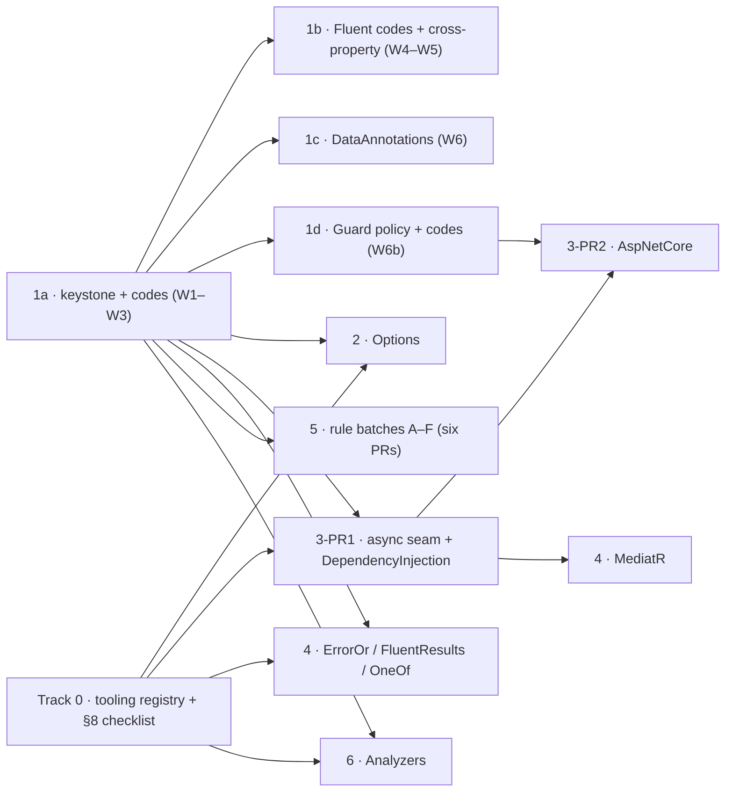

<!-- metadata_header
type: plan
id: new-surfaces-program
version: 1.3
status: active
last_updated: 2026-08-29
parent: new-surfaces-missing-validation-cases
children:
  - new-surfaces-missing-validation-cases-01-structural-validation.md
  - new-surfaces-missing-validation-cases-02-options.md
  - new-surfaces-missing-validation-cases-03-aspnetcore.md
  - new-surfaces-missing-validation-cases-04-mediatr-result-bridges.md
  - new-surfaces-missing-validation-cases-05-rule-batches.md
  - new-surfaces-missing-validation-cases-06-analyzers.md
  - new-surfaces-orchestration.md
-->

# Plan 00 — New Surfaces Program: Charter & Shared Standards

<!-- plan-nav -->
> [Parent](new-surfaces-missing-validation-cases.md) · **00 Program** · [01 Structural validation](new-surfaces-missing-validation-cases-01-structural-validation.md) · [02 Options](new-surfaces-missing-validation-cases-02-options.md) · [03 ASP.NET Core](new-surfaces-missing-validation-cases-03-aspnetcore.md) · [04 MediatR & bridges](new-surfaces-missing-validation-cases-04-mediatr-result-bridges.md) · [05 Rule batches](new-surfaces-missing-validation-cases-05-rule-batches.md) · [06 Analyzers](new-surfaces-missing-validation-cases-06-analyzers.md) · [Orchestration & progress](new-surfaces-orchestration.md)
<!-- /plan-nav -->

> [!IMPORTANT]
> **Read [`new-surfaces-orchestration.md`](new-surfaces-orchestration.md) first, every session.**
> It holds the live progress tracker (which units are done, in flight, or blocked), the
> sub-agent model-routing rules, and the per-unit checkpoint discipline this program is executed
> under. This charter says what to build; that file says how the work is actually run and where
> it currently stands.

> **Status**: Active | **Author**: Fable planning pass | **Created**: 2026-08-25
>
> **Parent**: [new-surfaces-missing-validation-cases.md](new-surfaces-missing-validation-cases.md) (Part 5 phasing).
> **Reconciled with**: [library-expansion-roadmap.md](library-expansion-roadmap.md) (which declares itself the successor of the parent — see §2).
>
> **Audience**: the implementing model (Sonnet 5) and the human operator. Read this file **once**, then the
> phase plan you are executing. Every phase plan assumes the standards in this file and does not restate them.

## 1. How to read this plan set

| File | Phase | One-line deliverable |
|---|---|---|
| this file | — | Charter, naming canon, package conventions, worktree→merge protocol, Definition of Done, new-scope checklist |
| [01 — Structural validation](new-surfaces-missing-validation-cases-01-structural-validation.md) | 1 | Error codes on every clause, the object-validator keystone (`IMustValidator<T>`, `MustValidationResult`, `MustValidator<T>`), cross-property, `When`/`Unless`, collection-element paths |
| [02 — Options](new-surfaces-missing-validation-cases-02-options.md) | 2 | `PineGuard.Extensions.Options` — `IValidateOptions<T>` adapter + `ValidateMustRules()` |
| [03 — ASP.NET Core](new-surfaces-missing-validation-cases-03-aspnetcore.md) | 3 | `PineGuard.Extensions.DependencyInjection`, `PineGuard.AspNetCore` (endpoint filter, MVC filter, exception handler, ProblemDetails, .NET 10 resolver), the async seam |
| [04 — MediatR & result bridges](new-surfaces-missing-validation-cases-04-mediatr-result-bridges.md) | 4 | `PineGuard.MediatR`, `PineGuard.ErrorOr`, `PineGuard.FluentResults`, `PineGuard.OneOf` |
| [05 — Rule batches](new-surfaces-missing-validation-cases-05-rule-batches.md) | 5 | Six vertical-slice batches (string content, identifiers, Unicode, numeric/financial, temporal + clock injection, file signatures) |
| [06 — Analyzers](new-surfaces-missing-validation-cases-06-analyzers.md) | 6 | `PineGuard.Analyzers` Roslyn analyzer + code fixes |

Each phase plan has the same five sections — **Business plan → Functional plan → Technical plan → Testing plan → Playbook** — followed by a Definition of Done, risks, and explicit out-of-scope items.

**Path convention used in every plan.** Existing files are written normally (`src/PineGuard.Core/MustClauses/MustResult.cs`). Files that the phase *creates* are written with a leading `+ ` inside the code span (`+ src/PineGuard.Extensions.Options/MustRulesValidateOptions.cs`) so the doc-links audit (Rule11) does not report them as broken references. Planned `.md`/`.ps1` files are referred to by filename with their folder stated in prose for the same reason.

### 1.1 Implementer quick start — where everything is

You are working inside a repository with a fully specified Brain (`docs/ai/`). Nothing in these plans restates it; this table is the map. **Read order on day one:** `CLAUDE.md` → `docs/ai/README.md` → this file → your phase plan → the specs its W0 step lists.

| Need | Where | Notes |
|---|---|---|
| The invariants for the layer you touch | `docs/ai/rules/global.md` + `docs/ai/rules/<scope>.md` (`core`, `must`, `guard`, `fluent`, `annotation`, `testing`, `tools`) | Path-scoped adapters in `.claude/rules/` load them automatically in Claude Code |
| Normative specs | `docs/ai/specs/spec.md` (root) · `orchestration.md` · `safety.md` (Tier 0/1/2 commands) · `coding-standard.md` · per layer `docs/ai/specs/<layer>/{project,unit-test,coverage}.md` · `language/{vocabulary.md,vocabulary.json,naming-collisions.md}` · `docs/ai/specs/tools/spec.md`, `docs/ai/specs/tools/audit-cli/spec.md` | A spec wins over a plan wherever they disagree; fix the plan |
| Scaffolding one layer | Skills in `docs/ai/skills/` (index `INDEX.md`): `scaffold-rule`, `scaffold-must`, `scaffold-guard`, `scaffold-fluent`, `scaffold-annotation`, `scaffold-unit-test`; `new-validation` drives a predicate through every layer | Claude Code wrappers live in `.claude/skills/` — invoke by name |
| A whole vertical slice (Phase 5) | Agent `docs/ai/agents/scaffold-vertical-slice.md` (`/scaffold-vertical-slice`) | It routes to the skills above and the per-layer specs |
| Writing tests / closing coverage | Subagents `.claude/agents/test-writer.md` (Sonnet), `coverage-analyst.md`; skill `improve-coverage` | Their learned patterns persist in `docs/ai/memory/<agent>.md` (canonical) and `.claude/agent-memory/<agent>/` — read yours before starting, append what you learn |
| Reviewing drift / layer parity | Subagents `code-reviewer.md`, `migration-checker.md`, `validation-builder.md` | Same memory convention |
| Slash commands (85 in `.claude/commands/`) | `/test-<scope>`, `/coverage-<scope>`, `/fix-coverage-<scope>`, `/format-<scope>`, `/document-<scope>`, `/commit-<scope>`, `/scan-roslyn-<scope>`, `/scan-qodana-<scope>`, `/audit-cli`, `/commit-doc`, `/commit-tool`, `/ask-council` | Each is an adapter over `docs/ai/agents/<name>.md`; `<scope>` ∈ `core must guard fluent annotation testing` today — new scopes are added by §8.4 |
| Run tests | `pwsh -NoProfile -ExecutionPolicy Bypass -File "./tools/testing/Run-Tests.ps1" -Project "<csproj>"` (or `-Solution`) | `-Configuration Release` for gate runs |
| Coverage 100/100 | `./tools/code-coverage/Run-CodeCoverage.ps1 -Mode GenerateAndAnalyze -Scope <Scope> -SkipHtml -Enforce100` | `-Scope` today: `Core`, `MustClauses`, `GuardClauses`, `DataAnnotations`, `FluentValidation`, `Testing`, `All`; new scopes are added by §8.3 |
| Audit rules | `./tools/audit-cli/Run-All.ps1 -Configuration Release -RuleId <ids>`; rule scripts in `tools/audit-cli/rules/Test-Rule*.ps1`; catalogue in `tools/audit-cli/README.md` | Rule ids used in this program: 03, 06, 07, 08, 10, 11, 12, 13 (new), 14 (new), 50, 53 |
| Format / Roslyn / Qodana | `tools/code-formatter/Run-Format.ps1`, `tools/code-diagnostics/Run-CompilerDiagnostics.ps1`, `tools/code-inspection/Run-Qodana.ps1` | All take `-Scope` |
| Structural checks | `tools/maintenance/Test-StructuralIntegrity.ps1` (namespace = folder, one type per file, …) | Run before every PR |
| Commits | `tools/git/Run-Commits.ps1 -<Scope> -IncludeTests -AutoMessage` or `/commit-<scope>`; message = conventional subject (`feat(must): …`) + 1–4 sentences of flowing prose body | Never squash; never rebase a pushed branch (§6) |
| Hooks that will stop you (`.claude/hooks/`) | `block-sln-edit` (use `dotnet sln`), `enforce-output-dirs` (write only under `artifacts/`, `logs/`), `pre-bash-destructive-guard` (Tier 0), `pre/post-bash-lock` + `coordination.sh` (one `dotnet` operation per machine; `status` board), `post-edit-format-check`, `post-edit-testdata-check` (TestData conventions) | Hook output is feedback, not noise — fix the cause |
| Test conventions you will be audited on | `[Theory]` + `TheoryData` + `[MemberData]` only; `XxxTests.cs` beside `XxxTestData.cs`; `<Member>_BehavesAsExpected(tc)`; fixtures `XxxRulesFixtures.Yyy.cs` mirror `XxxRules.Yyy.cs`; `IsValid` is the uniform expectation boolean; no `[ExcludeFromCodeCoverage]` | `docs/ai/specs/testing/unit-test.md`, `fixture.md`, `gold-standard.md` |
| Where planned files are written | `+ src/...` inside code spans (this file §1, above) | Rule11 audits every other backticked path |
| Decisions already taken | §12 of this file (decision log), §13 (layer parity) and `docs/ai/specs/language/naming-collisions.md` §Type names vs vocabulary | Do not re-open them; extend the log when you make a new one |
| Plans folder conventions | `docs/ai/meta/taxonomy.md` §Plans: `metadata_header`, `status`, `plans/completed/` archive; flat `.md` only | The catalogue review artifact in Plan 01 W2 is a `.md` for this reason |


## 2. Relationship to the parent and the roadmap

The parent plan lists six phases (Part 5). `docs/ai/plans/library-expansion-roadmap.md` (v2.0, same day) states that it supersedes the parent and adds one thing the parent lacks: a **keystone object-level contract** (`IMustValidator<T>` + an aggregate result). The Options, ASP.NET, and MediatR adapters all validate *objects*, and `MustResult<T>` validates a single *value* — so the parent's Phase 2 cannot be built without the keystone. Resolution:

- The six-phase structure and numbering of the **parent** are kept (this is what the operator asked for).
- The keystone is folded into **Phase 1**, which is where the parent already puts "structural gaps" and error codes.
- Roadmap items *not* in the parent (Part 5.2, the recursive DataAnnotations object-graph walker — 5.1's `ToValidationResults()` and 5.3's `ValidationContext` clock resolution *are* adopted, in §13.4 and Plan 05 Batch E; Part 6 Json/Xml depth; Part 8, public validator assertion helpers in the already-published `PineGuard.Testing`) are **out of this program's scope** and are noted where a phase touches their edge. They should get their own plans after Phase 3 proves the keystone.
- Where the parent and roadmap disagree on an adapter's internals (e.g. `HttpClient` request-side validation), the roadmap's later design wins because it corrected a real flaw (a `DelegatingHandler` sees serialized content, not the model).

## 3. Business plan (program level)

### 3.1 Thesis

PineGuard's pitch is *"one rule library, every call site"*. Today that is true for four **call-site styles** (Must, Guard, Fluent, DataAnnotations) but false for the **runtime seams** where validation actually executes in a 2026 .NET application: options binding at startup, request pipelines, mediator pipelines, and result-oriented domain code. This program extends the pitch to *"one rule library, every call site, every seam"* — and, with the analyzer, gives the library a distribution channel that no competitor has.

### 3.2 Why this order

| Phase | Strategic reason |
|---|---|
| 1 | Decides head-to-head evaluations against FluentValidation (cross-property, conditional, collection-element, error codes). Everything downstream consumes its types. |
| 2 | Smallest possible adapter; proves the keystone before it ossifies; immediate real-world value (`ValidateOnStart`). |
| 3 | Flagship integration and the biggest surface. Captures demand FluentValidation abandoned (auto-validation) and rides .NET 10's built-in validation. |
| 4 | Tiny shims with broad reach; each is ≤ 150 lines of production code. |
| 5 | Continuous cheap wins; can run in parallel with 2–4 once Phase 1's error-code convention exists. |
| 6 | Growth channel; only worth shipping once the surface it advertises (Guard) is stable. |

### 3.3 Success metrics (program)

- Eight new NuGet packages (`PineGuard.Extensions.Options`, `.DependencyInjection`, `.AspNetCore`, `.MediatR`, `.ErrorOr`, `.FluentResults`, `.OneOf`, `.Analyzers`), each with a paired `*.UnitTests` project at **100% line and 100% branch** coverage. (If the still-open bridge decision in §12 trims Phase 4 to ErrorOr-only, this becomes six packages and the `fluentresults`/`oneof` scopes are dropped everywhere.)
- Every one of the ~550 `Must.Be.*` clauses carries a stable machine-readable code; the code catalogue is audited by a new audit rule.
- An evaluator can write an object validator with cross-property, conditional and collection rules in the first ten minutes using only the README.
- Zero regressions: the existing 13,698 tests per TFM keep passing; the existing public API changes only as Plan 01 §3.2 lists — additive everywhere except the Guard exception-policy redesign, which deletes members outright under §4.6.

### 3.4 Program risks

| Risk | Mitigation |
|---|---|
| The keystone shape ossifies before an adapter stresses it | Phase 2 immediately consumes it; interface growth after Phase 1 uses default interface members so additions stay non-breaking |
| New packages dilute the 100 %/audit discipline | Every package adopts every CI gate before its first commit (§8 checklist); no package merges below 100 % |
| Scope creep across eight packages | Each phase plan carries a hard "Out of scope" list; anything not listed in a phase's Functional plan is a new plan, not a stretch goal |
| `netstandard2.1` drift (features silently missing on the oldest asset) | Every phase states its TFM set and which members are `#if NET8_0_OR_GREATER`-gated; the README's supported-frameworks section is updated per package |
| ASP.NET coupling to framework versions | `PineGuard.AspNetCore` targets `net8.0;net10.0` only; .NET 10 pieces sit behind `#if NET10_0_OR_GREATER` |
| Adapter naming collides with framework-native names | §5 naming canon; every adapter name was checked against the framework it sits beside |

## 4. Package conventions (apply to every new package)

### 4.1 Naming

- **Package id / assembly / root namespace** are identical and name the seam the package adapts, spelled the way its owner spells it. Two tiers: **`PineGuard.Extensions.<X>`** adapts a `Microsoft.Extensions.<X>` seam (`PineGuard.Extensions.Options`, `PineGuard.Extensions.DependencyInjection`); **`PineGuard.<Framework>`** adapts a framework or library by its own root id (`PineGuard.AspNetCore`, `PineGuard.MediatR`, `PineGuard.ErrorOr`, `PineGuard.FluentResults`, `PineGuard.OneOf`, `PineGuard.Analyzers`; existing precedent `PineGuard.FluentValidation`, `PineGuard.DataAnnotations`). The infix follows `Serilog.Extensions.Hosting` / `Polly.Extensions` / `AutoMapper.Extensions.Microsoft.DependencyInjection`, and it removes the misreading of `PineGuard.Options` as "options for configuring PineGuard". There is deliberately no bare `PineGuard.Extensions` grab-bag: `Microsoft.Extensions` is a family prefix, never a package, and only the two Microsoft.Extensions adapters are dependency-light enough to share a package — everything else carries a framework reference or a third-party dependency (and licence) that no consumer should be forced to take.
- **Namespace equals package id**, and folders inside the project match namespaces. `tools/maintenance/Test-StructuralIntegrity.ps1` checks namespace/folder alignment, so the Microsoft habit of putting `IServiceCollection` extensions into the `Microsoft.Extensions.DependencyInjection` namespace is deliberately **not** followed — consumers add one `using PineGuard.<Framework>;`.
- **Extension classes** are singular and named for the type they extend: `OptionsBuilderExtension`, `MustValidationResultExtension` (precedent: `FluentExtension`, `StringExtension`, `MustResultExtension`). When two packages extend the same type, each prefixes the feature it adds so the class names never collide in a consumer's file: `MustValidatorServiceCollectionExtension` (`PineGuard.Extensions.DependencyInjection`) and `MustValidationServiceCollectionExtension` (`PineGuard.AspNetCore`).
- **Bridge packages whose last namespace segment is also a target type name** (`PineGuard.OneOf` vs `OneOf<…>`, `PineGuard.ErrorOr` vs `ErrorOr<T>`/`Error`, `PineGuard.FluentResults` vs `Error`) fully qualify every target type with `global::` in source (`global::OneOf.OneOf<T, MustFailure>`), because inside `namespace PineGuard.OneOf;` the simple name `OneOf` binds to the enclosing namespace first (`docs/ai/specs/language/naming-collisions.md`).
- **Scope identifier** (taxonomy §N.4) for agents, commands, coverage and commit tooling is the lowercase framework token: `options`, `di`, `aspnetcore`, `mediatr`, `erroror`, `fluentresults`, `oneof`, `analyzers`. PowerShell `-Scope` values use the PascalCase seam name (`Options`, `DependencyInjection`, `AspNetCore`, …) — the `Extensions.` infix is part of the package id, never of a scope id, folder token or worktree name.

### 4.2 Target frameworks

| Package kind | TFMs | Why |
|---|---|---|
| Library adapters whose dependency ships a `netstandard2.0`/`2.1` asset (Options, DependencyInjection, MediatR, ErrorOr, FluentResults, OneOf) | `netstandard2.1;net8.0;net10.0` (inherited from `Directory.Build.props`) | Same reach as the five existing packages |
| `PineGuard.AspNetCore` | `net8.0;net10.0` (override in csproj) | Requires `<FrameworkReference Include="Microsoft.AspNetCore.App" />`; there is no netstandard asset for ASP.NET Core |
| `PineGuard.Analyzers` (+ CodeFixes) | `netstandard2.0` (override in csproj) | Roslyn analyzers must target netstandard2.0 |
| Every `*.UnitTests` | `net8.0;net10.0` (inherited from `tests/Directory.Build.props`) | Tests are executables |

Anything that only exists on net8+ (`INumber<T>`, `TimeProvider` without the BCL package, `Microsoft.Extensions.Validation`) is gated with `#if NET8_0_OR_GREATER` / `#if NET10_0_OR_GREATER` exactly as `src/PineGuard.MustClauses/MustNumberClauses.cs` already is. A member that exists on some TFMs and not others is documented in the package README's *Supported frameworks* section.

### 4.3 Dependencies

- Central Package Management only: every new package version goes into `Directory.Packages.props`; csprojs carry no versions.
- Reference the **latest stable major** of each Microsoft.Extensions.* package (repo precedent: `System.Text.Json` is pinned to the 10.0 line). Microsoft.Extensions.* 10.x ships `netstandard2.0` and `net8.0` assets, so the `netstandard2.1` and `net8.0` PineGuard assets still resolve.
- Every adapter references `PineGuard.Core` (for `MustResult<T>`, `MustValidationResult`, `IMustValidator<T>`); it references `PineGuard.MustClauses` **only when its own surface or its README examples use `Must.Be.*`** — Options and AspNetCore do, DependencyInjection, MediatR and the three result bridges do not (the §4.4 skeleton marks that line optional).
- `PineGuard.Core` itself carries no package references, with one deliberate exception decided for Phase 5 Batch E: `Microsoft.Bcl.TimeProvider` on `netstandard2.1` only, a first-party BCL package that makes `TimeProvider` one API on every TFM (§12). No adapter references another adapter except as listed in its phase plan (e.g. `PineGuard.AspNetCore` → `PineGuard.Extensions.DependencyInjection`).
- Third-party packages (MediatR, ErrorOr, FluentResults, OneOf) are referenced with `PrivateAssets` left at default so the dependency flows to consumers; the version pin is the lowest line that has the API we need *and* a license the repo accepts (see Phase 4 for MediatR).
- Dependabot: add a group per new ecosystem in `.github/dependabot.yml` (`microsoft-extensions: ["Microsoft.Extensions.*"]`, `mediatr`, `result-libraries`, `microsoft-codeanalysis` already exists).

### 4.4 Project skeleton (copy for every new library)

```xml
<Project Sdk="Microsoft.NET.Sdk">

  <PropertyGroup>
    <Description>One sentence: what the package does, in the voice of the existing package descriptions.</Description>
    <PackageTags>$(PackageTags);tag-one;tag-two</PackageTags>
  </PropertyGroup>

  <ItemGroup>
    <None Include="..\..\docs\brand\pineguard-logo-128px.png" Pack="true" PackagePath="\" />
    <None Include="README.md" Pack="true" PackagePath="\" />
  </ItemGroup>

  <ItemGroup>
    <InternalsVisibleTo Include="PineGuard.Xxx.UnitTests" />
  </ItemGroup>

  <ItemGroup>
    <PackageReference Include="Framework.Package" />
  </ItemGroup>

  <ItemGroup>
    <ProjectReference Include="..\PineGuard.Core\PineGuard.Core.csproj" />
    <ProjectReference Include="..\PineGuard.MustClauses\PineGuard.MustClauses.csproj" />   <!-- only when the package exposes Must.Be.* (§4.3) -->
  </ItemGroup>

</Project>
```

Also required per package: `README.md` beside the csproj (the four-block shape used by the existing package READMEs: benefit-first masthead → install → 3–5 canonical examples → "one rule library, every call site" closer + links), and `AGENTS.md` containing the single line `Read docs/ai/rules/<scope>.md before writing or editing any PineGuard.<Framework> code.`

### 4.5 Test project skeleton (copy for every new test project)

```xml
<Project Sdk="Microsoft.NET.Sdk">

  <PropertyGroup>
    <IsPackable>false</IsPackable>
    <IsTestProject>true</IsTestProject>
    <SonarQubeTestProject>true</SonarQubeTestProject>
  </PropertyGroup>

  <ItemGroup>
    <PackageReference Include="coverlet.collector" />
    <PackageReference Include="Microsoft.NET.Test.Sdk" />
    <PackageReference Include="xunit" />
    <PackageReference Include="xunit.runner.visualstudio" />
  </ItemGroup>

  <ItemGroup>
    <Using Include="Xunit" />
  </ItemGroup>

  <ItemGroup>
    <ProjectReference Include="..\..\src\PineGuard.Core\PineGuard.Core.csproj" />
    <ProjectReference Include="..\..\src\PineGuard.Xxx\PineGuard.Xxx.csproj" />
    <ProjectReference Include="..\PineGuard.Testing\PineGuard.Testing.csproj" />
  </ItemGroup>

</Project>
```

Test rules that apply unchanged (from `docs/ai/specs/testing/unit-test.md` and `docs/ai/specs/testing/fixture.md`): `[Theory]` + `TheoryData` + `[MemberData]` only; every `XxxTests.cs` has an `XxxTestData.cs` beside it; flat test classes; `<Member>_BehavesAsExpected(<Case> tc)` naming; AAA markers; no empty datasets; 100 % line + branch; `[ExcludeFromCodeCoverage]` is never used — widen to `internal` and test directly instead. Test projects that assert a result type no existing layer base understands inherit `BaseUnitTest` directly and keep a project-local `XxxExpected`/`XxxCase` pair (precedent: `tests/PineGuard.DataAnnotations.UnitTests/ThrowsCase.cs`); a family is promoted into `tests/PineGuard.Testing/` only when two projects need it (`docs/ai/specs/testing/project.md` §3.1).

### 4.6 Compatibility before the first release

PineGuard has not had its first release. Until it does, public API changes are made **directly**: a replaced member is deleted and every call site, test and doc is updated in the same PR. No `[Obsolete]` shims, no dual code paths, no "removed in next major" notes (owner, 2026-08-26). A compatibility policy is written at the first release.

## 5. Naming canon

Names are the product. Every public identifier introduced by this program is listed here with the one-sentence story it tells, so that the six phases share one vocabulary. A phase plan may *refine* a name's members but may not rename what is listed here without updating this table.

### 5.1 Existing vocabulary the new names must sit beside

| Existing | Meaning |
|---|---|
| `Must.Be.X(value)` → `MustResult<T>` | One check on one value; never throws; `Success`/`Failed`, `Message`, `ParamName`, `Value`, `Result` |
| `Guard.Against.X(value)` | One check that throws (`ArgumentException` family by default; `GuardExceptionPolicy` can substitute) |
| `GuardExceptionPolicy.Map(Func<GuardFailure, Exception>)` / `BeginScope(…)` / `Clear()` / `HasMap` | How an application substitutes its own exceptions. The class stays (isolated startup configuration, typed once — not on `Guard`, typed at every call site); the class carries the noun so members do not repeat it; "map" is ASP.NET's word for exception→something translation and a map's absence explains itself; `BeginScope` is the .NET scope word. Rejected: a `Default`/`Global`/`Current` value model (value, slot and read under one noun), `ReplaceExceptions`/`UseDefaultExceptions`/`Suspend` verbs, `Replace` as the verb (clunky noun forms), `MapExceptionsInScope`/`MapExceptionsScoped`, `Disable…` (implies a retained map; also as an alias), members on `Guard`, a `services.` helper — Plan 01 §4.14.1 |
| `GuardFailure` | Was the static thrower; becomes the failure itself — `Code`, `Message`, `ParamName`, `Value`, `Exception` — keeping static `Throw(IMustResult, …)` (BCL idiom: `ArgumentNullException.ThrowIfNull`). Phase 1d stamps `Data["pineguard.code"]` / `["pineguard.property-path"]` on every thrown exception for downstream readers without subclassing the BCL types |
| `ExceptionExtension.TryGetMustCode / HasMustCode / GetMustProperty` | Read the stamped code/property from an already-thrown exception without touching `Data` by string |
| `Guard.Against.Invalid(value, validator)` | The validator in Guard style; FV precedent `ValidateAndThrow` |
| `MustResultExtension.Combine` | Homogeneous roll-up of many `MustResult<T>` into one, joining messages |
| Fluent `MustBe(...)`, DataAnnotations `ValidationAttributeBase` | Adapter seams over Must |
| Test `MustExpected`, `MustCase<T>`, `BaseMustUnitTest` | Per-layer assertion family; `IsValid` is the uniform test-side boolean |

**Naming rule — align vocabulary, distinguish types (owner, 2026-08-26).** Ecosystem alignment and collision risk rise together: the more universal a word, the more likely a consumer or another framework already owns it. So the canon splits by what a name competes with. *Members, verbs, parameters and patterns* never enter a consumer's own type list, so they **align** with the mass language (`RuleFor`, `PropertyPath`, `BeginScope`, `.WithErrorCode`). *Importable type names* compete with everything else in the consumer's `using`s, so they **distinguish** with the short mechanism qualifier: `MustCodes` not `ErrorCodes` (owned by countless apps), `MustPropertyRule` not `PropertyRule` (FluentValidation), `MustValidationResult` not `ValidationResult` (DataAnnotations *and* FluentValidation), `MustFailure` not `Failure`. A collision costs every implementer a CS0104 alias in every file; a qualifier costs four characters once. This is why the catalogue is `MustCodes` even though `ErrorCodes` is the more recognisable word.

### 5.2 New names (Phase 1 — Core, namespace `PineGuard.MustClauses` unless stated)

| Name | On the tin | Rejected alternatives and why |
|---|---|---|
| `IMustResult` | The non-generic view of any `MustResult<T>` so results of different `T` can be collected together | `IMustOutcome` (new noun for no gain) |
| `MustResult<T>.Code` | The stable, machine-readable identity of the rule that failed (`""` on success) | `ErrorCode` — the Must vocabulary is *fail/failed*, not *error*, and the sibling property is `Message`, not `ErrorMessage` |
| `MustResult<T>.MessageTemplate` | The raw message with the `{paramName}` token still in it, so a validator can re-render it for a property path | `Template` (too vague) |
| `MustCodes` | The catalogue of every code as `const string`, nested domain → aspect → condition so the identifier path mirrors the code (`MustCodes.Email.Address.Invalid` ↔ `email.address.invalid`)  — every node declares a `Prefix` and every value is composed from its parent (`Prefix + ".invalid"`), which C# folds to a compile-time constant, so codes stay legal in attributes and constant patterns while each segment is spelled once (Plan 01 §4.1); a `static partial class` split one file per domain (`MustCodes.Email.cs` beside `MustEmailClauses.cs`), the repo's `StringRules.Bool.cs` convention, housed in `src/PineGuard.Core/Codes/` as namespace `PineGuard.Codes` — a top-level sibling of `PineGuard.Rules` because codes are cross-layer vocabulary; the type stays `MustCodes` because codes are born in Must and every layer calls Must. Rejected: `PineGuard.MustClauses.Codes` (nests shared vocabulary under one call-site style), `PineGuard.MustCodes` (namespace/type collision, CA1724), `ErrorCodes` (the one non-Must name in a Must family) — separate `MustEmailCodes`-style types were rejected because static classes cannot be re-exported under one parent | `MustCode` (a class of many constants is a catalogue, plural); nesting by clause class (`MustCodes.EmailClauses.Email`) — mirrors implementation, not the address consumers see |
| `MustFailure` | One failure inside a validation result: `PropertyPath`, `Code`, `Message`, `Value`. `Value` is never serialised by any adapter (a test asserts it) | `MustError` (vocabulary — reserved for one place: the FluentResults bridge, whose target noun is `Error`, ships `MustError : FluentResults.Error`; PineGuard's own failure nouns stay `MustFailure`/`GuardFailure`), `MustViolation` (legalistic) |
| `MustFailure.PropertyPath` | Where in the object the failure is: `Email`, `Address.City`, `Lines[2].Sku`; `""` for the root | FluentValidation's own term, "property" in its sense (any member expression; `""` for the root). `MemberPath` (DataAnnotations/CLR spelling, not the community's), `Path` (reads as file path) |
| `MustValidationResult` | Everything a validator found: `Success`/`Failed`, `Failures`, `Message`; the object-level counterpart of `MustResult<T>` | `MustResultSet` (implies it *contains* `MustResult<T>` instances — it contains failures; "result set" is database jargon), `MustResults` (one letter from `MustResult`, unpronounceable in a code review), `MustReport` (plain English, but no validation library anywhere calls this a report — the ecosystem noun is *result*; superseded 2026-08-26) |
| `MustValidationException` | Thrown by `MustValidationResult.ThrowIfFailed()`; carries the `Result`. This — not `ArgumentException` — is the marker that an API boundary produced a validation failure | `MustException` (says nothing), `MustFailureException` (a failure that is an exception?) |
| `IMustValidator` / `IMustValidator<in T>` | Something that validates a whole object and returns a validation result; non-generic form for runtime dispatch | `IValidator<T>` (FluentValidation's exact name — both will be in scope for Fluent users) |
| `MustValidator<T>` | The base class you derive from; `RuleFor`, `RuleForEach`, `Validate`, `ValidateAsync` | `AbstractMustValidator<T>` (Java-ism), `MustSpec<T>` (Validot-ism) |
| `InlineMustValidator<T>` | A `MustValidator<T>` you configure with a lambda instead of a subclass (Options and tests need it) | `AdHocMustValidator<T>` |
| `MustValidator<T>.RuleFor(...)` / `RuleForEach(...)` | "The rule for this property is…" — the lingua franca every evaluator already knows | `Check`, `Ensure`, `Member`, `Property`, `Must(...)` (the last is impossible: an instance method named `Must` shadows the static `Must` class inside the validator body) |
| `MustPropertyRule<T, TProperty>` | What `RuleFor` returns; carries `When`, `Unless`, `WithCode`, `WithMessage`, `WithPropertyPath` | FluentValidation's type behind `RuleFor` is `PropertyRule<T, TProperty>` — the mass language. `MustRule` (overloads "rule" with Core `XxxRules`, the `RuleCase` test family and the audit rules), `MustMemberRule` ("member" is the DataAnnotations/CLR word, not the community's), `IRuleBuilderOptions` (an interface name, not a type) |
| `MustResultExtension.AndThen` / `When` / `Unless` | Chain a second check onto a success; keep or drop a failure depending on a condition | `Then`/`Bind` (functional jargon); `If` (reads backwards) |
| `MustResultExtension.ToMustValidationResult(propertyPath?)` | Lift one `MustResult<T>` into the aggregate type, losslessly | `ToValidationResult` (rejected 2026-08-26: three different `ToValidationResult(s)` would have existed — Core → `MustValidationResult`, the Fluent bridge → FluentValidation's `ValidationResult`, the DataAnnotations bridge → `IEnumerable<ValidationResult>`; naming the target type removes the collision, and the proposed Fluent bridge `ValidationResult.ToMustValidationResult()` then shares the verb honestly) |
| `MustValidationMode { Aggregate, StopOnFirstFailure }` (Phase 3, Core) | How a validator stops: collect everything (default) or stop at the first failing rule | `CascadeMode` (FluentValidation's name, but theirs is per-rule and per-validator; ours is a mode passed to `ValidateAsync`) |
| `PropertyPathUtility` (namespace `PineGuard.Utils`) | Builds and transforms property paths: `Combine`, `Index`, `Key`, `Transform`, `FromExpression` — pure string/expression-tree work, no reflection | `PropertyPath` (clashes with the property of the same name on `MustFailure`) |
| `ValidationAttributeBase.Code` (constructor parameter `code`, namespace `PineGuard.DataAnnotations.Common`) | Every PineGuard attribute declares, statically, the code of the clause it adapts — the framework's `ValidationResult` has no slot for one, so the code lives on the adapter object exactly as FluentValidation's `WithErrorCode` fixes it on the rule; consumer-defined attributes pass their own string (`"acme.order.sku.unknown"` — their own domain, same grammar) | `CodedValidationResult : ValidationResult` (a framework-type subclass named for an adjective, which every framework path flattens to a message anyway) |

### 5.3 New names (Phases 2–6, package namespaces)

| Package | Name | On the tin |
|---|---|---|
| `PineGuard.Extensions.Options` | `MustRulesValidateOptions<TOptions>` | The `IValidateOptions<T>` that `ValidateMustRules()` installs; same shape as Microsoft's `DataAnnotationValidateOptions<T>`. `MustValidateOptions<T>` (rejected 2026-08-26: three characters from `MustValidationOptions`, the ASP.NET options bag, and both land in the same `Program.cs`) |
| | `OptionsBuilderExtension.ValidateMustRules(...)` | Verb + mechanism, exactly Microsoft's `ValidateDataAnnotations()` shape: `.ValidateDataAnnotations().ValidateMustRules().ValidateOnStart()`. **Brand lives in namespaces and package ids; members name the mechanism** — the rule every existing member already follows (`Must.Be`, `Guard.Against`, `[Email]`). `ValidateWithPineGuard()` (rejected: the first branded member in the library; branding belongs in namespaces and package ids — error codes carry no prefix either, §5.4) |
| `PineGuard.Extensions.DependencyInjection` | `MustValidatorServiceCollectionExtension.AddMustValidator<TValidator>()`, `AddMustValidatorsFromAssembly(...)`, `AddMustValidatorsFromAssemblies(...)`, `AddMustValidatorsFromAssemblyContaining<T>()` | Register one or many validators; the verbs mirror FluentValidation's DI package so migration is obvious. Default lifetime `Singleton`; validators with async rules usually depend on scoped services and are registered with `ServiceLifetime.Scoped` |
| | `ServiceProviderExtension.TryGetMustValidator(Type, out IMustValidator?)`, `GetMustValidators(Type)` | Runtime lookup for adapters that only know the `Type` |
| `PineGuard.AspNetCore` | `MustValidationOptions` | Options for the ASP.NET integration (naming policy, code emission, guard-exception handling, `UnknownGuardCode`); reaches every filter and handler as `IOptions<MustValidationOptions>`; mechanism-named like the `MustValidation*` filter/handler family it configures. `ValidationOptions` alone collides with `Microsoft.Extensions.Validation`; `PineGuardValidationOptions` (rejected: branded member) |
| | `MustValidationEndpointFilter`, `MustValidationActionFilter`, `MustValidationExceptionHandler` | Named for what they are (`IEndpointFilter`, `IAsyncActionFilter`, `IExceptionHandler`) and what they carry (Must validation) |
| | `AddMustValidation(...)` (on `IServiceCollection` — two overloads, `params Assembly[]` and `Action<MustValidationOptions>, params Assembly[]` — on `IMvcBuilder`, and on endpoint convention builders) | One verb, three receivers: "add Must validation to X"; sits beside .NET 10's `AddValidation()` and matches the `MustValidationEndpointFilter` / `MustValidationActionFilter` / `MustValidationExceptionHandler` it registers. `AddPineGuardValidation()` (rejected — the `AddSerilog`/`AddMediatR` root-registration convention is branded, but PineGuard's own surface never is; the one autocomplete hit it loses is covered by the README's first example) |
| | `ProblemDetailsExtension.ToValidationProblemDetails(this MustValidationResult, …)` | The RFC 9457 body; `failures` extension member carries codes |
| | `IMustFailureMessageResolver` (+ `StringLocalizerMustFailureMessageResolver`) | The localization seam: given a failure and a request, produce the message text |
| | `MustValidatableInfoResolver` (net10) + `ValidationOptions.AddMustValidators()` | The `IValidatableInfoResolver` that plugs PineGuard validators into `Microsoft.Extensions.Validation`, and the one-line registration. **Open (§12)**: `AddMustValidators()` reads as validator *registration* next to the DI package's `AddMustValidatorsFromAssembly`; council recommendation is `AddMustValidatorResolver()` (it adds a resolver) — owner's call before 3-PR2 |
| `PineGuard.MustClauses` (Phase 3) | `MustPredicateClauses.SatisfiesAsync` / `NotSatisfiesAsync` | The async predicate seam; the only async clause pair |
| `PineGuard.Core` (Phase 3) | `MustValidator<T>.RuleForAsync` / `RuleForEachAsync` | Async rules; explicit suffix so overload resolution never guesses |
| `PineGuard.MediatR` | `MustValidationBehavior<TRequest, TResponse>` | The `IPipelineBehavior` |
| | `IMustFailureResponseFactory<out TResponse>` | Registered by the consumer to short-circuit with a response instead of throwing |
| | `AddMustValidation()` (on `MediatRServiceConfiguration`) | Same verb as ASP.NET |
| `PineGuard.ErrorOr` / `.FluentResults` / `.OneOf` | `ToErrorOr()`, `ToErrors()`, `ToResult()`, `MustError`, `ToOneOf()` | Bridges named by their target's own vocabulary |
| `PineGuard.Analyzers` | Diagnostic ids `PG1001`–`PG1004` (prefer a Guard), `PG2001` (discarded Must result) | `PG` is short, unclaimed by the well-known analyzer families (CA, CS, IDE, SA, S, MA, VSTHRD, xUnit) |
| Test infrastructure | `MustValidationExpected : ReturnExpected`, `MustValidationCase<T> : ReturnCase<…>`, `MustValidationScenarioExtension.ToMustValidationCases`, `BaseMustValidationUnitTest` | The layer family for asserting `MustValidationResult`, shaped exactly like the existing families (`docs/ai/specs/testing/project.md` §3 rule 2); needed by Core, Options, AspNetCore and MediatR tests → lives in `tests/PineGuard.Testing/UnitTests/MustClauses/` |
| Test infrastructure (Phase 5 Batch E) | `FixedTimeProvider` (`tests/PineGuard.Testing/Common/`) | A `TimeProvider` frozen at one instant, shared by every layer's temporal tests; ships in the published `PineGuard.Testing` package, so it gets its own tests and README line |

### 5.4 Error-code grammar (used by every phase)

A code is an **address**, not a label — it addresses a rule the way an XPath addresses a node. Every code has exactly three segments, each carrying something a consumer can key on, and the shape never varies:

```text
<domain> . <aspect> . <condition>
    │          │           └─ the failure state observed on the aspect — the exact complement of the rule (controlled vocabulary)
    │          └─ the facet of the value the rule looks at (a noun)
    └─ the family of value being validated (~30, fixed by the clause class — see the map)
```

Because the depth is fixed, a consumer can split on `.` and trust that position 1 is the domain, 2 the aspect, 3 the condition. Because every prefix is meaningful, `text.length.*` is "every length failure" and `owasp.*.unsafe` is "every OWASP safety failure".

A code is only ever *seen* on failure — in a 400 body, a log line, a localisation table, a test — so its last segment names **what was observed**, not what was required: `email.address.invalid`, never `…valid`. The requirement is what the message says ("Email must be a valid email address."); the pair reads *requirement + violation*, each carrying the half the other lacks. This is the Zod / pydantic / `ArgumentOutOfRangeException` convention, and it is what lets a code be read correctly with no prior knowledge of PineGuard.

Precedent check (2026-08-26): libraries split between codes that name the *failure* (Zod `too_small`, pydantic `string_too_short`, Rails `blank`, .NET exception names) and codes that name the *constraint* (FluentValidation `EmailValidator`, Angular `required`, Spring `NotNull`, Ajv `minLength`) — but the constraint-named half use **nouns**; no library uses an outcome adjective such as `valid`. Messages are requirement-phrased nearly everywhere, PineGuard's included, so failure-phrased codes give the pair *violation + requirement*. The condition vocabulary therefore prefers constraint nouns that read as failures (`missing`, `blank`, `duplicate`, `out-of-range`, `mismatch`) and uses `not-…` only where no such noun exists — the point where both conventions coincide.

**No library prefix** (owner decision 2026-08-26, reversing an earlier `pineguard.` prefix). Precedent: no validation library brands its codes — FluentValidation `NotEmptyValidator`, Zod `invalid_type`, pydantic `string_too_short`, Rails `blank`, Stripe `card_declined`. The identifiers that *are* prefixed — Roslyn diagnostics (`CS…`, `CA…`, `IDE…`), Sonar (`S…`), Bean Validation message keys — share one property: many independent sources emit into one stream, so the prefix disambiguates the source. A validation result has one source, the application; its 400 body, log line or localisation table has nothing to disambiguate from, and the error code is the important thing in that output, not the library that produced it. This is the same principle as §5.3 — brand lives in namespaces and package ids, never on the surface — and an error code is the most visible surface the library has. Collision with consumer-defined codes requires an identical three-segment address for a different meaning, which is the consumer's own bug; if provenance is ever needed, a consumer (or a later `PineGuard.MustClauses` helper — never the `Codes/` leaf itself) builds the set by reflecting over `typeof(MustCodes)` in ten lines. The rule is applied consistently: `Exception.Data["pineguard.code"]` / `["pineguard.property-path"]` *keep* their prefix because `Data` is a shared, multi-source bag, and analyzer ids `PG…` keep theirs because Roslyn's diagnostic stream is multi-source.

**Grammar rules**

1. Exactly three segments, lowercase, kebab-case within a segment: `^[a-z][a-z0-9]*(-[a-z0-9]+)*(\.[a-z][a-z0-9]*(-[a-z0-9]+)*){2}$`.
2. **No segment repeats its parent.** A domain's headline rule uses the noun of the thing validated as the aspect and `invalid` as the condition: `email.address.invalid` — never `email.email`.
3. The domain is fixed by the clause class (map below). It names the *family of value*, not the CLR type.
4. Aspect and condition are **curated** when the clause is written, exactly like its message — never generated from a method name. Conditions come from the controlled vocabulary; extend it deliberately, in this section.
5. **One rule, one code, whatever the input type**: `Positive` on numbers and on numeric strings share `number.sign.not-positive`; `After` on `DateTime`/`DateOnly`/`DateTimeOffset` shares `date.order.not-after`; `Satisfies` and `SatisfiesAsync` share `predicate.result.false`.
6. **The condition is the exact complement of the rule.** Use a natural antonym only where it is exact — `valid`→`invalid`, `present`→`missing`, `distinct`→`duplicate`, `safe`→`unsafe`, `true`→`false` — otherwise a `not-` prefix: `Positive` failing is `not-positive` (`negative` would exclude zero), `After` failing is `not-after`. A `Not*` clause's code is the un-negated state it caught: `NotHasEmailAlias` → `email.alias.present`, `Null` (must be null) → `value.state.not-null`.
7. Codes are **public API**: freely revisable until the first release (§4.6), frozen from the first release on — renaming one is then a breaking change.
8. The catalogue mirrors the path — `MustCodes.Email.Address.Invalid` ↔ `"email.address.invalid"` — structurally: values are composed constants (`Prefix + ".invalid"`, folded at compile time). Audit Rule13 verifies the textual invariants (every clause passes a constant; no code string literal outside `src/PineGuard.Core/Codes/`) and the reflection test `MustCodesTests` verifies grammar shape, mirroring, uniqueness and `<summary>` agreement.

**Domain map** (clause class → domain)

| Clause classes | Domain |
|---|---|
| `Null`, `DefaultEquality`, `Object` | `value` (aspects `state`, `equality`; plus the reserved `argument` aspect — `MustCodes.Value.Argument.Invalid` is emitted only by adapters for an argument exception PineGuard did not throw) |
| `Bool`, `StringBool` | `boolean` |
| `String`, `StringCasing` (+ Phase 5 graphemes) | `text` |
| `Char` | `character` |
| `Number`, `StringNumbers`, `StringNumberTypes` (+ Phase 5 decimal) | `number` |
| `BitWise` | `bitwise` |
| `Enum` | `enum` |
| `Guid`, `StringGuid` | `guid` |
| `DateTime`, `DateOnly`, `DateTimeOffset`, `SqlDateTime`, `StringDateOnly`, `StringDateTimeOffset` | `date` |
| `TimeOnly`, `TimeSpan`, `StringTimeOnly`, `StringTimeSpan` | `time` |
| `DateTimeRange`, `DateOnlyRange`, `DateTimeOffsetRange`, `TimeOnlyRange` | `range` |
| `Collection` | `collection` |
| `Dictionary`, `ReadOnlyDictionary` | `dictionary` |
| `Email` / `Phone` / `Uri` / `Network` | `email` / `phone` / `uri` / `network` |
| `Http`, `HttpSecurityHeader` | `http` |
| `Json` / `Xml` / `Csv` | `json` / `xml` / `csv` |
| `FilePath` (+ Phase 5 file signatures) | `file` |
| `GeoLocation`, `StringGeoLocation` | `geo` |
| `Owasp` / `Identifier` / `Predicate` / `Task` | `owasp` / `identifier` / `predicate` / `task` |
| `Buffer` | `encoding` |
| Phase 5: `Token`, `Version`, `Cron`, `Checksum` | `token`, `version`, `cron`, `checksum` |

**Controlled condition vocabulary** — failure states, extend here deliberately: `invalid`, `not-strict`, `missing`, `present`, `null`, `not-null`, `default`, `not-default`, `empty`, `not-empty`, `blank`, `null-or-empty`, `mismatch`, `too-short`, `too-long`, `too-few`, `too-many`, `out-of-range`, `exceeded`, `not-equal`, `equal`, `not-greater`, `not-less`, `not-before`, `not-after`, `not-past`, `not-future`, `not-positive`, `not-negative`, `zero`, `not-zero`, `odd` (for `Even`), `even` (for `Odd`), `duplicate`, `not-distinct`, `not-contains`, `contains`, `not-subset`, `no-match`, `match`, `unsafe`, `false`, `true`, `not-completed`, `canceled`, `faulted`, `not-utc`, `not-local`, `not-weekday`, `not-weekend`, `below-minimum`, `unknown`, `malformed`, `not-normalized`, `normalized`, `well-formed`, `not-multiple`, `not-absolute`, `not-object`, `not-percentage`, `starts-with`, `not-starts-with`, `ends-with`, `not-ends-with`, `not-first-day-of-month`, `not-last-day-of-month`, `exceeded`, plus the negated casing, charset and scheme names (`not-upper`, `not-camel`, `not-ascii`, `not-digits`, `not-https`, `not-http`, `not-file`). Every entry is the state a consumer would *see*; if a proposed condition reads as a requirement, it belongs on the message, not the code.

**Worked examples**

| Clause(s) | Code |
|---|---|
| `Email` / `StrictEmail` | `email.address.invalid` / `email.address.not-strict` |
| `HasEmailAlias` / `NotHasEmailAlias` | `email.alias.missing` / `email.alias.present` |
| `NotNull` / `Null` / `NotDefault` | `value.state.null` / `…state.not-null` / `…state.default` |
| `EqualTo` / `NotEqualTo` | `value.equality.not-equal` / `…equality.equal` |
| `NotNullOrWhiteSpace` / `NotNullOrEmpty` / `NotEmpty` (string) | `text.content.blank` / `…content.null-or-empty` / `…content.empty` |
| `LengthBetween` / `ExactLength` / `LongerThan` | `text.length.out-of-range` / `…length.mismatch` / `…length.too-short` |
| `Uppercase` / `CamelCase` / `Ascii` / `DigitsOnly` / `Match` | `text.casing.not-upper` / `…casing.not-camel` / `…charset.not-ascii` / `…charset.not-digits` / `…pattern.no-match` |
| `Positive` (number and numeric string) / `InRange` / `Even` / `MultipleOf` | `number.sign.not-positive` / `…range.out-of-range` / `…parity.odd` / `…divisibility.not-multiple` |
| `Past` / `After` / `Weekday` / `Utc` (all temporal types) | `date.relative.not-past` / `…order.not-after` / `…calendar.not-weekday` / `…kind.not-utc` |
| `NotEmpty` (collection) / `HasCountBetween` / `HasDistinctItems` / `Contains` | `collection.items.empty` / `…count.out-of-range` / `…items.duplicate` / `…items.missing` |
| `HasKey` (both dictionary types) | `dictionary.keys.missing` |
| `Guid` (string) / `NotEmpty` (guid) | `guid.format.invalid` / `guid.value.empty` |
| `HttpsUrl` / `AbsoluteUri` / `HasScheme` | `uri.scheme.not-https` / `uri.form.not-absolute` / `uri.scheme.mismatch` |
| `IpAddress` / `Hostname` / `PortNumber` | `network.address.invalid` / `network.hostname.invalid` / `network.port.invalid` |
| `Json` / `JsonObject` / `Xml` / `CsvLine` | `json.document.invalid` / `json.root.not-object` / `xml.document.invalid` / `csv.line.invalid` |
| `XssSafe` / `SqlInjectionSafe` / `OwaspSafe` | `owasp.xss.unsafe` / `owasp.sql-injection.unsafe` / `owasp.payload.unsafe` |
| `Slug` / `Satisfies` / `Completed` / `Base64` / `True` / `Latitude` | `identifier.slug.invalid` / `predicate.result.false` / `task.status.not-completed` / `encoding.base64.invalid` / `boolean.value.false` / `geo.latitude.invalid` |

Reading test for any new code: "*domain* → *aspect* → *condition*" must read as the problem in plain English, the way a support ticket would state it ("email address invalid", "text length out-of-range", "number sign not-positive", "date order not-after"). If it reads as a requirement, flip the condition; if it still doesn't read, the aspect is wrong.

## 6. Worktree → merge protocol (every phase, every batch)

All work happens in a git worktree on a feature branch and reaches `main` through a pull request that passes every CI gate. The commands below are Tier 2 (safe) except where marked; Tier 1 steps require operator confirmation per `docs/ai/specs/safety.md` even though this program authorizes the *plan*.

```text
# 0. Start from a clean, current main (run from the main checkout)
git fetch origin
git status                                   # must be clean
git log --oneline -1 origin/main

# 1. Create the worktree + branch (path is gitignored: .claude/worktrees/)
git worktree add ".claude/worktrees/<slug>" -b "feature/<slug>" origin/main
#    <slug> examples: structural-validation, options, aspnetcore, mediatr-bridges,
#                     rules-string-content, rules-identifiers, analyzers

# 2. Announce scope (Claude Code hook-backed status board; other surfaces: say it in the reply)
bash "$CLAUDE_PROJECT_DIR/.claude/hooks/coordination.sh" status running "<slug>: <phase title>"   # contract: status <running|idle> [detail]

# 3. Work ONLY inside the worktree path. Every dotnet/pwsh command uses the worktree's
#    absolute path (scripts resolve the repo root from their own location).

# 4. Gates — all must be green before a commit is called "done" (see §7)

# 5. Commit by named file with a conventional-commits subject and a prose body
git -C ".claude/worktrees/<slug>" add <files…>
git -C ".claude/worktrees/<slug>" commit -m "feat(options): …" -m "Why …"
#    or the scoped helper once the new scope exists: tools/git/Run-Commits.ps1 -<Scope> -IncludeTests -AutoMessage

# 6. Push (Tier 1 — confirm with the operator)
git -C ".claude/worktrees/<slug>" push -u origin "feature/<slug>"

# 7. Pull request; wait for CI (build, test matrix, coverage 100%, format, roslyn, audit Rule50)
gh pr create --base main --head "feature/<slug>" --title "<subject>" --body-file <body.md>
gh pr checks --watch

# 8. Merge (Tier 1 — confirm). Merge commit, not squash: the scoped commits are the history.
gh pr merge --merge --delete-branch
#    If the PR touches .github/workflows/*, the GH_TOKEN in use may lack `workflow` scope;
#    the operator merges from the UI or with a token that has it.

# 9. Clean up — ONLY after `git -C ".claude/worktrees/<slug>" status` is clean (remove discards uncommitted work; treat as Tier 1)
git worktree remove ".claude/worktrees/<slug>"
bash "$CLAUDE_PROJECT_DIR/.claude/hooks/coordination.sh" status-clear
```

Rules of the road:

- One phase = one worktree = one PR, **except** Phase 5, where each batch is its own worktree/PR, and Phase 1 workstream W6 (DataAnnotations cross-property attributes), which may ship as a second PR off the same branch base.
- Never rebase a pushed branch; merge `origin/main` into the feature branch if it falls behind (`git merge origin/main`, Tier 2).
- Never edit `PineGuard.slnx` by hand — the `.claude/hooks/block-sln-edit.sh` hook blocks it. Use `dotnet sln PineGuard.slnx add <csproj>` (test projects land in the `/tests/` solution folder: `dotnet sln PineGuard.slnx add --solution-folder tests <csproj>`).
- `Directory.Build.props` / `Directory.Packages.props` edits are Tier 1 — state the exact lines before changing them.
- All temporary output goes to `artifacts/` or `logs/` inside the worktree.

**Backing out.** A merged unit is never force-reverted on `main`: open a revert PR (`git revert -m 1 <merge-sha>` on a fresh worktree), merge it through the same gates, then every open branch runs `git merge origin/main`. If the owner rejects the Plan 01 W2 catalogue at the curation checkpoint, nothing has been rewritten yet by design — the checkpoint sits *before* the render pass; fold the feedback into the map and re-render. If the keystone-freeze checkpoint (§10.2) fails — an adapter needs a change to `IMustValidator<T>`/`MustValidationResult` — the change ships as a Phase 1 follow-up PR from `main` and every open branch merges it before continuing.

## 7. Definition of Done (template — every phase copies and ticks it)

- [ ] **Build**: `dotnet build PineGuard.slnx -c Release` — zero warnings across `netstandard2.1;net8.0;net10.0` (or the package's declared TFMs).
- [ ] **Tests**: the §9 test command (`Run-Tests.ps1 -Solution ./PineGuard.slnx -Configuration Release`) green on `net8.0` and `net10.0`; no `[Fact]`, no `[InlineData]`; every `XxxTests.cs` has its `XxxTestData.cs` (Rule50, the one audit rule CI enforces).
- [ ] **Coverage**: `tools/code-coverage/Run-CodeCoverage.ps1 -Mode GenerateAndAnalyze -Scope <Scope> -SkipHtml -Enforce100 -Framework net10.0` **and** the same with `-Framework net8.0` exit 0 for every scope the phase touched, **and** `-Scope All` (both frameworks, `-Enforce100` stated explicitly — it is not auto-applied for `All`) still exits 0. Two runs because the report generator keeps only the newest `coverage.cobertura.xml` per project, so a single multi-TFM run analyses whichever TFM finished last and `#if NET10_0_OR_GREATER` members can silently go unmeasured.
- [ ] **Format**: `dotnet format PineGuard.slnx --verify-no-changes` clean.
- [ ] **Roslyn**: `dotnet build PineGuard.slnx -c Release --no-incremental` shows zero `CS` warnings.
- [ ] **Audit**: `tools/audit-cli/Run-All.ps1 -Configuration Release -RuleId Rule50` clean (CI gate); Rule06, Rule08 clean for any phase that adds Must clauses; the new Rule13 (Must codes) clean from Phase 1 onward; Rule14 (Core stays synchronous) clean from Phase 3 onward; Rule11/Rule12 clean for any phase that adds agents or docs; Rule09/Rule10 clean for any phase that adds or edits a `tools/**/*.ps1` (new audit rules, the codes generator, the scope registry).
- [ ] **Docs**: package `README.md` + `AGENTS.md`; `docs/ai/specs/<scope>/project.md`, `unit-test.md`, `coverage.md`; `docs/ai/rules/<scope>.md`; root `README.md` package table and *Supported frameworks*; `docs/ai/specs/testing/gold-standard.md` row; XML docs on every public member (CS1591 is an error).
- [ ] **Tooling**: every item in §8 that applies is done.
- [ ] **Adapters**: every new agent cascaded per `docs/ai/meta/adapter-surfaces.md` §5; Rule12 clean.
- [ ] **Merged to main** via PR with all CI jobs green; worktree removed.

## 8. New-scope onboarding checklist

Adding a package to this repository touches more than `src/` and `tests/`. This is the complete list, derived from every script and config that enumerates scopes today. Phase 2 executes it first and records anything missing; later phases reuse it.

### 8.1 Solution and build

| # | File | Change |
|---|---|---|
| 1 | `PineGuard.slnx` | `dotnet sln PineGuard.slnx add src/PineGuard.<Fw>/PineGuard.<Fw>.csproj` and `dotnet sln PineGuard.slnx add --solution-folder tests tests/PineGuard.<Fw>.UnitTests/PineGuard.<Fw>.UnitTests.csproj` (never by hand) |
| 2 | `Directory.Packages.props` | `PackageVersion` for each new dependency (Tier 1 edit) |
| 3 | `.editorconfig`, the section header matching `^\[tests/\{` (line 520 today; it moves with every scope PR) | The test-project section header is an **explicit brace list** — add `PineGuard.<Fw>.UnitTests` to `[tests/{…}/**/*.cs]` or the new tests get none of the test relaxations |
| 4 | `src/PineGuard.Core/PineGuard.Core.csproj` | Add `<InternalsVisibleTo Include="PineGuard.<Fw>" />` **only if** the package applies `[CallerArgumentExpression]` on its `netstandard2.1` build (it needs the internal polyfill) |
| 5 | `sonar-project.properties` | Add `S3236` / `S107` multicriteria entries only if the package passes `paramName: null` or has the Guard-style parameter count; add `sonar.cpd.exclusions` only for deliberate structural duplication |
| 6 | `.github/dependabot.yml` | Group for the new ecosystem |

### 8.2 CI

| # | File | Change |
|---|---|---|
| 7 | `.github/workflows/ci.yml` | (a) `dorny/paths-filter` entry `<scope>: ['src/PineGuard.<Fw>/**', 'tests/PineGuard.<Fw>.UnitTests/**']`; (b) matching job output; (c) test-matrix `include` entry with a `run-if` label; (d) `case "$RUN_IF"` arm listing every upstream scope the package depends on (Core, Must, and any adapter it references) plus `testing` and `main`; (e) **every downstream scope's arm gains the new scope** (a change to a base package must run the tests of everything built on it); (f) the coverage job merges every surviving `coverage.cobertura.xml` into one report — pass `-assemblyfilters:` to reportgenerator restricted to the assemblies whose own test job ran, otherwise a PR that runs only one matrix entry fails the gate on partially-covered upstream assemblies; (g) the `Setup .NET` step installs `10.0.x` only — add `8.0.x` so the `net8.0` leg is actually executed in CI |
| 7b | `.github/workflows/ci.yml` coverage threshold step | **Resolved 2026-08-29 (§12)**: `vars.MIN_CODE_COVERAGE` raised to 100. CI hard-gates on it via an explicit "Fail if coverage check failed" step; `continue-on-error: true` on the check step was never gate-softening — it only defers that failure so the sticky PR comment can post first, and the following step still fails the job, so it was left unchanged. The 100/100 rule in §7 is now the CI-enforced minimum, not just a local one. Verified via a live CI re-run (job `99088572473`) after setting the variable: `Line coverage: 100% (required: 100%)`, `Branch coverage: 100% (required: 100%)` |

### 8.3 Tooling scripts that enumerate scopes

| # | File | Change |
|---|---|---|
| 8 | `tools/code-coverage/Run-CodeCoverage.ps1` | `-Scope` `ValidateSet`; the auto-`Enforce100` list; the default `ProjectFilter` switch |
| 9 | `tools/code-coverage/xplat/Gen-CoverageReport.ps1` | `ValidateSet`; source-dir switch; expected-path regex switch; include-pattern switch (`[PineGuard.<Fw>]*`); default project filter switch; the `default` (All) regex and include list |
| 10 | `tools/code-coverage/xplat/Test-CoverageAnalysis.ps1` | `ValidateSet`; source-dir switch; `IncludeFileRegex` switch; the `All` regex |
| 11 | `tools/.shared/coverage.ps1` line 215 | `$prefixes` list |
| 12 | `tools/code-formatter/Run-Format.ps1` | `ValidateSet` + project switch |
| 13 | `tools/code-diagnostics/Run-CompilerDiagnostics.ps1` | `ValidateSet` + project map |
| 14 | `tools/code-inspection/Run-Qodana.ps1` + a new `qodana.<scope>.yaml` in `tools/code-inspection/qodana/config/` + a new `PineGuard.<Fw>.Qodana.slnx` beside the existing per-scope ones | `ValidateSet`, config switch, slug switch |
| 15 | `tools/code-inspection/auto/Run-Coverage.ps1` | `ValidateSet` |
| 16 | `tools/git/Run-Commits.ps1` + a new `Commit-<Fw>.ps1` in `tools/git/` (copy `tools/git/Commit-MustClauses.ps1`) | Switch parameter, `-All` expansion, `$any` guard, scoped-commit call |
| 17 | `tools/git/Commit-Agent.ps1` | Add `src/PineGuard.<Fw>/AGENTS.md` to the agent-file list |
| 18 | `tools/release/Run-GithubRelease.ps1` line 278 | Package list |
| 19 | `tools/release/Run-NugetUnlist.ps1` line 46 | Package list |
| 20 | `tools/audit-cli/rules/Test-Rule53-TestOrphans.ps1` | Nothing to edit: it derives `src/<TestProject minus .UnitTests>` and skips projects whose source folder is absent. Consequences: a normal scope resolves automatically; `PineGuard.Analyzers.UnitTests` maps to `+ src/PineGuard.Analyzers` only, so code-fix tests live inside the analyzer test classes (Plan 06 §3.2); `PineGuard.Testing.UnitTests` is skipped entirely. Rule53 is a local convention check, not a CI gate |
| 21 | `.vscode/tasks.json` | `Test: <Fw> (fast)`, `Coverage: <Fw> (fast)`, `Format: <Fw>`, `Git: Commit <Fw> (auto message)`, `Inspect: Qodana: <Fw>` |
| 21a | `tools/audit-cli/rules/Test-Rule13-MustCodes.ps1` | The hardcoded `$extraRoot` array (currently `src/PineGuard.Core`, `src/PineGuard.DataAnnotations`, `src/PineGuard.AspNetCore`) that Rule13 check (b) scans for MustCodes constant usage — add `src/PineGuard.<Fw>` when the new scope carries `Must.Be.*` call sites of its own. Missing from the original checklist; found and fixed during Plan 02's Options fix-and-reverify pass (2026-08-29) |

**Recommended once, in Phase 2**: before adding the first scope, extract the per-scope *paths* (source dir, test csproj, include pattern, path regex) into one registry function `Get-PineGuardScope -Name <Scope>` in `tools/.shared/dotnet-projects.ps1`, and have items 8–15 read from it. `ValidateSet` attributes stay literal (PowerShell requires constants), so a new scope is then one `ValidateSet` token per script plus one registry entry, instead of five `switch` blocks per script. If this refactor is declined, the manual edits above are the fallback and each later phase repeats them.

### 8.4 Brain and adapters

| # | Where | Change |
|---|---|---|
| 22 | `docs/ai/specs/<scope>/` (new folder) | `project.md`, `unit-test.md`, `coverage.md` using `docs/ai/meta/template-project.md`, `template-unit-test.md`, `template-coverage.md`; register the folder in `docs/ai/specs/spec.md` §11 and `docs/ai/specs/dependencies.md` §3–4 |
| 23 | `docs/ai/rules/` | `<scope>.md` (inherits `global.md`, points at the three specs); add the scope to `docs/ai/README.md` rules hierarchy and to the layer maps in `.clinerules/02-layers.md`, `.windsurf/rules/layers.md`, `.amazonq/rules/layers.md`, `.cursor/rules/<scope>.mdc`, `.github/instructions/<scope>.instructions.md`, `.claude/rules/<scope>.md` |
| 24 | `docs/ai/meta/taxonomy.md` §N.4 | Add the scope identifier |
| 25 | `docs/ai/agents/` | `test-<scope>.md`, `coverage-<scope>.md`, `fix-test-<scope>.md`, `fix-coverage-<scope>.md`, `format-<scope>.md`, `document-<scope>.md`, `commit-<scope>.md`, `scan-roslyn-<scope>.md`, `scan-qodana-<scope>.md` — nine delegating stubs per `docs/ai/meta/template-agent.md`, each cascaded via `docs/ai/skills/scaffold-workflow/SKILL.md` to `.claude/commands/`, the three root boot files `CLAUDE.md`, `AGENTS.md`, `GEMINI.md` (`docs/ai/meta/adapter-surfaces.md` §1), `.agent/workflows/`, `.pi/prompts/`, `.pi/AGENTS.md` (Copilot subset: none of these) |
| 26 | `docs/ai/commands/` | Rows in `test.md`, `coverage.md`, `fix.md`, `format.md`, `document.md`, `commit.md`, `scan.md` |
| 27 | `docs/ai/workflows/test.md`, `coverage.md`, `format.md`, `commit.md` and `docs/ai/agents/test-all.md`, `coverage-all.md`, `format-all.md` | Add the scope to the parameter tables / project maps / summary tables |
| 28 | `docs/ai/specs/testing/coverage.md`, `gold-standard.md` | Library list; Project Summary row |
| 29 | Root `README.md` | Package table row, install snippet, *Supported frameworks* |

## 9. Quality gates (what "green" means)

| Gate | Command | Source |
|---|---|---|
| Build, zero warnings | `dotnet build PineGuard.slnx -c Release` | `.github/workflows/ci.yml` build job |
| Tests | `pwsh -NoProfile -ExecutionPolicy Bypass -File "./tools/testing/Run-Tests.ps1" -Project "<csproj>"` per project or `-Solution ./PineGuard.slnx` (the script's `.PARAMETER Solution` help still says `.sln` — fix the text when first touched). Track 0 (merged) installs both 8.0.x and 10.0.x SDKs in CI, so the `net8.0` leg of multi-targeted test projects is now actually exercised there, not just locally | `docs/ai/workflows/test.md` |
| Coverage 100/100 | `pwsh -NoProfile -ExecutionPolicy Bypass -File "./tools/code-coverage/Run-CodeCoverage.ps1" -Mode GenerateAndAnalyze -Scope <Scope> -SkipHtml -Enforce100 -Framework net10.0` then `… -Framework net8.0` (one TFM per run — see §7). CI gate: hard-fails at `vars.MIN_CODE_COVERAGE` = 100 (raised 2026-08-29, §8 item 7b) via the explicit fail step; `continue-on-error` does not soften this | `docs/ai/specs/testing/coverage.md` |
| Format | `dotnet format PineGuard.slnx --verify-no-changes` | ci.yml format job |
| Roslyn | `dotnet build PineGuard.slnx -c Release --no-incremental` and grep `warning CS` | ci.yml roslyn job |
| Audit | `pwsh -NoProfile -ExecutionPolicy Bypass -File "./tools/audit-cli/Run-All.ps1" -Configuration Release -RuleId Rule50` (+ `Rule06,Rule08,Rule13` when clauses change; `Rule11,Rule12` when docs/agents change) | `docs/ai/agents/audit-cli.md` |
| Qodana (optional, recommended before the PR) | `docs/ai/workflows/scan-qodana.md` | — |

Run builds, tests and coverage **sequentially** — the coordination hook holds one `dotnet-ops` lock per machine (`docs/ai/rules/coordination.md`).

## 10. Execution playbook — order, parallelism, critical path

The phase numbers are the **priority** order from the parent plan, not a required execution order. Only one chain is hard: everything needs Phase 1a; ASP.NET Core and MediatR need Phase 3-PR1. Everything else is standalone once 1a is on `main`.

### 10.1 Work units and their real dependencies

| Unit | What it is | Hard dependency (must be **merged** first) | Adds a scope? |
|---|---|---|---|
| **Track 0** | The `Get-PineGuardScope` registry in `tools/.shared/dotnet-projects.ps1` + the refactor of §8.3 items 8–15 to read it + the §8.2 CI changes (7e–7g, and 7b if approved) + a Rule13-style `Codes/` purity check is **not** here (it is Rule13 (g), Plan 01). Creates **no** `src/` or `tests/` project — the first scope (Options) is onboarded by Plan 02 using the registry. **Current state**: approved, running in Wave 0 (§12). | — | — (touches `tools/`, `.github/`, `.vscode/tasks.json` only; must not touch `tools/audit-cli/`, which 1a owns) |
| **1a** | Phase 1 W1–W3: `IMustResult`, codes migration + Rule13, `MustValidationResult`, `MustValidator<T>` keystone, test family | — | no |
| **1b** | Phase 1 W4–W5: Fluent `ErrorCode` + cross-property temporal overloads | 1a | no |
| **1c** | Phase 1 W6: `ValidationAttributeBase.Code` + cross-property attributes | 1a | no |
| **1d** | Phase 1 W6b: the Guard exception-policy redesign (`GuardExceptionPolicy.Map/BeginScope/Clear/HasMap`, `GuardFailure` data type), codes on thrown exceptions (`Exception.Data["pineguard.code"]` / `["pineguard.property-path"]`, 538 scripted call-site rewrites), `ExceptionExtension`, `Guard.Against.Invalid` | 1a | no |
| **2** | `PineGuard.Extensions.Options` | 1a, Track 0 | yes |
| **3-PR1** | async seam (`RuleForAsync`, `SatisfiesAsync`, `MustValidationMode`, Rule14) + `PineGuard.Extensions.DependencyInjection` | 1a, Track 0 | yes |
| **3-PR2** | `PineGuard.AspNetCore` | 3-PR1, **1d** (the exception handler reads the stamped codes through `ExceptionExtension`) | yes |
| **4-bridges** | `PineGuard.ErrorOr`, `.FluentResults`, `.OneOf` | 1a, Track 0 | yes |
| **4-mediatr** | `PineGuard.MediatR` | 3-PR1 (DI package reference; drop that reference to move it into Wave 1 — it only needs `IEnumerable<IMustValidator<T>>` from standard DI) | yes |
| **5-A … 5-F** | Six rule batches, each its own PR | 1a (codes + Rule13); 5-E also adds `FixedTimeProvider` to `PineGuard.Testing` | no |
| **6** | `PineGuard.Analyzers` | 1a (`MustResult<T>` shape for PG2001), Track 0 | yes |



### 10.2 Waves

| Wave | Units that may run concurrently | Gate to start |
|---|---|---|
| 0 | Track 0 ∥ 1a (Track 0 owns `tools/.shared/`, `tools/code-*`, `.github/`; 1a owns `src/`, `tests/`, `tools/audit-cli/`; shared: `.vscode/tasks.json`, union-merge) | `main` clean |
| 1 | 1b ∥ 1c ∥ 1d ∥ 2 ∥ 3-PR1 ∥ 4-bridges ∥ 5-A…5-F ∥ 6 | 1a merged (+ Track 0 merged for any unit that adds a scope) |
| 2 | 3-PR2 ∥ 4-mediatr | 3-PR1 merged |

The waves are **logical dependency groups, not a concurrency instruction**: the coordination lock serialises builds on one machine (§10.3) and thirteen long-lived branches against a moving `main` would spend their time in union merges. Keep two or three branches open at once and follow §10.4.

**Critical path**: 1a → 3-PR1 → 3-PR2. Nothing else delays a later unit, so on a single machine start 1a first, then keep 3-PR1 moving while the standalone units fill idle time.

**Keystone-freeze checkpoint**: after **2** and **4-bridges** are merged (two adapters have consumed `IMustValidator<T>`/`MustValidationResult`), declare those types stable; until then any change they need goes into a Phase 1 follow-up PR that every open branch merges from `main`.

### 10.3 Rules for running units in parallel

- Independent unit = its own worktree, branch and PR (§6). Two units never share a worktree.
- The known **union-merge set** — files every scope-adding unit touches and that will conflict trivially: `PineGuard.slnx`, `Directory.Packages.props`, `.editorconfig` (line 520 list), `.github/workflows/ci.yml`, `tools/git/Run-Commits.ps1`, `.vscode/tasks.json`, `CLAUDE.md`, root `AGENTS.md`, `GEMINI.md`, `.pi/AGENTS.md`, root `README.md`, `docs/ai/README.md`, `docs/ai/specs/testing/gold-standard.md`, `docs/ai/specs/testing/coverage.md`, `docs/ai/meta/taxonomy.md`, `.github/dependabot.yml`, `sonar-project.properties`, `tools/.shared/dotnet-projects.ps1`, `tools/audit-cli/rules/Load-Catalog.ps1`, plus for clause-adding units the `src/PineGuard.Core/Codes/MustCodes.<Domain>.cs` file of any domain two units both extend (the per-domain split keeps most batches conflict-free) and `docs/ai/specs/language/vocabulary.json`. Resolve by taking both sides; `git merge origin/main` into the branch before opening the PR; never rebase a pushed branch.
- **One machine builds one thing at a time** — the coordination hook serialises `dotnet build`/`test`/coverage across sessions (`docs/ai/rules/coordination.md`). Parallel authorship is fine; verification interleaves. True concurrency needs separate machines (cloud sessions) — CI then verifies each PR independently.
- A unit that would change a file another open branch owns (e.g. 1b touching `FluentExtension.cs` while 3-PR1 adds `MustBeAsync` to the same file) coordinates by merging `main` early and often; the status board (`coordination.sh status`) is how sessions see each other.
- Standalone units (5-A…F, 6, 4-bridges, 2) each ship value alone; a paused program still leaves `main` coherent after any merged unit.

### 10.4 Recommended single-machine sequence

`1a → Track 0 → 2 → 4-bridges` (keystone freeze) `→ 3-PR1 → 3-PR2 → 4-mediatr`, with `1b`, `1c`, `5-A…F` and `6` slotted into any gap — they never block anything and never need to wait for anything but 1a.

## 11. Deliberately not in this program

- DataAnnotations recursive object-graph walker and `IValidatableObject` bridges (roadmap Part 5) — separate plan after Phase 3.
- Client-side (`IClientModelValidator`) adapters, OpenAPI schema emission, Blazor `EditForm` for Must validators, `PineGuard.Testing` validator assertions, localisation resources — each recorded with its reason in §13.
- Json/Xml Core depth (roadmap Part 6) — separate plan.
- Public validator assertion helpers in `PineGuard.Testing` (roadmap Part 8) — the package is **already published** (`tools/release/Run-GithubRelease.ps1`), so the `MustValidationResult` test family and `FixedTimeProvider` added here ship in it; a consumer-facing assertion API (`ShouldHaveFailure(...)`) is a later plan.
- `HttpClient` response-contract validation, MassTransit/Wolverine/Mediator shims, gRPC/SignalR/Hangfire/Functions entry points — listed in Phase 3/4 as explicitly deferred.
- Any `Core / Common API Decisions` item (`docs/ai/plans/core-common-api-decisions.md`) — those are the owner's calls and are not smuggled into these phases, even where a phase touches the same file (e.g. `IsValidHostname` is used as-is).

## 12. Decision log

Decisions taken with the owner after the plan set was first written. Each is already applied throughout Plans 00–06; this log records the *why* so nobody re-litigates it.

| Date | Decision | Rationale (short) | Where applied |
|---|---|---|---|
| 2026-08-25 | Execution is not strictly 01→06; only `1a → 3-PR1 → 3-PR2 (→ 4-mediatr)` is a hard chain | Everything else depends only on Phase 1a; standalone units fill idle time | §10 |
| 2026-08-26 | Error codes are fixed three-segment addresses `<domain>.<aspect>.<condition>`, curated, never derived from method names | The mechanical `email.email` scheme doubled segments and read poorly; codes must be XPath-like with every segment load-bearing and the domain always present | §5.4; Plan 01 §4.1 (curation checkpoint; Rule13 = textual usage checks, `MustCodesTests` = shape, mirroring, uniqueness) |
| 2026-08-26 | `MustReport` → `MustValidationResult` | No validation library calls the aggregate a report; the ecosystem noun is *result* (FluentValidation, `ValidateOptionsResult`) | §5.2; Plans 01–04 |
| 2026-08-26 | `MustRule` → `MustPropertyRule<T, TProperty>`; "member" → "property" vocabulary (`PropertyPath`, `PropertyPathUtility`, `PropertyNamingPolicy`, `[AfterProperty]`, `RuleFor(… expression, …)`) | Align with the mass language of the community — FluentValidation `PropertyRule`, `PropertyName`, `PropertyPath`; System.Text.Json `PropertyNamingPolicy` — for free education; "rule" was also overloaded four ways (Core `XxxRules`, validator rules, `RuleCase` tests, audit rules) | §5.2; Plans 01, 03 |
| 2026-08-26 | DataAnnotations carries the code on the attribute — **mandatory** `ValidationAttributeBase(Type expectedType, string code, bool allowNull)` — never on a framework `ValidationResult` subtype (`CodedValidationResult` rejected) | Codes are not new to any layer; only the framework-owned result object varies, and DataAnnotations' has no slot. One principle for all adapters: fill the framework's slot for a code, otherwise the adapter object carries it — which also yields design-time metadata. A code-less overload for consumer attributes is deferred and demand-driven: additive later, whereas the reverse order would be breaking | §5.2; Plan 01 §2.4, §3.2, §4.13, §5.1, §5.5 |
| 2026-08-26 | Rename triage rule | Simple renames across the stack: do them; large blast radius *and* low confidence: pass | memory `feedback_naming-standards` |
| 2026-08-26 | The condition segment names the **failure state**, never the requirement: `email.address.invalid`, not `…valid` | A code is only ever seen on failure; a code ending in `valid` beside an error misreads. Zod, pydantic and .NET's own exception names name the failure; the message keeps the positive requirement, so code + message read *violation + requirement*. Every rule has exactly one failure state, so the code still identifies the rule 1:1 | §5.4 (rules 2, 6, vocabulary, worked examples); example codes in Plans 01–05 |
| 2026-08-26 | Registration members name the mechanism, never the brand: `ValidateMustRules()`, `AddMustValidation()`, `AddMustValidators()`, `MustValidationOptions` | Brand belongs in namespaces and package ids (and in the namespace position of a code); every existing PineGuard member is already brand-free. Precedent: Microsoft `ValidateDataAnnotations()`, FluentValidation's DI package `AddValidatorsFromAssembly()`, Zod's `z.` namespace with abstract methods; the branded `AddSerilog`-style root registration is the one convention PineGuard chooses not to follow | §5.3; Plans 02, 03, 04 |
| 2026-08-26 | Guard exceptions carry the code in `Exception.Data["pineguard.code"]` / `["pineguard.property-path"]` via `GuardFailure.Throw(IMustResult, …)`; promoted from a Phase 3 stretch to Phase 1d | Codes must reach every layer; the BCL exception types have no code slot and are deliberately not subclassed, so the framework's extensibility bag is the slot; a policy replacer can then build a coded domain exception | §5.2, §10; Plan 01 §4.14, §5.6, W6b; Plan 03 handler |
| 2026-08-26 | `GuardExceptionPolicy` members → `Map` / `BeginScope` / `Clear` / `HasMap`; `GuardFailure` becomes the map's input type; `ReplaceDefaultExceptions`, `ExceptionReplacer`, `GuardExceptionPolicyOptions`, `ThrowAndReplace` deleted; `ExceptionExtension`; `Guard.Against.Invalid`; Plan 03 option `MapGuardExceptions` → `HandleGuardExceptions` | The flag was dead code (only the BCL family ever reached the replacer); `null`/`false`/`Default` as the off state were all rejected as implied or ambiguous; a map's absence explains itself; one input type removes the two-parameter lambda; configuration stays isolated from the hot path; the class carries the noun | Plan 01 §4.14.1–3, W6b; Plan 03; §5.2 |
| 2026-08-26 | No backward compatibility before the first release | Nobody to be compatible with yet; shims cost clarity | §4.6 |
| 2026-08-26 | Track 0 (the `Get-PineGuardScope` registry refactor) is approved and runs in Wave 0 | Eight scopes × five `switch` blocks per script is the alternative; Plan 02 no longer carries a "if declined" branch | §8.3, §10.1; Plan 02 W1 |
| 2026-08-26 | `PineGuard.Core` takes exactly one package reference, `Microsoft.Bcl.TimeProvider`, `netstandard2.1`-only, in Phase 5 Batch E | First-party BCL package; the alternative (`DateTime now` overloads) forks the temporal API per TFM | §4.3; Plan 05 Batch E |
| 2026-08-26 | `MustResultExtension.ToValidationResult` → `ToMustValidationResult` | Three `ToValidationResult(s)` members with three different target types would have existed once the Fluent and DataAnnotations bridges land; name the target | §5.2; Plan 01 §3.2, §4.11 |
| 2026-08-26 | `Guard.Against.Invalid` throws the `ArgumentException` family through the map like every other guard — never `MustValidationException` | Guards are 500 by default; `MustValidationException` is the boundary marker Phase 3 maps to 400, and a DDD constructor is three layers deep. The full result stays reachable: `validator.Validate(x).ThrowIfFailed()` is the boundary spelling | §13.1; Plan 01 §4.14.3; Plan 03 §4.3 |
| 2026-08-26 | Rule13 ships in stages with the PR that adds the code it audits (1a: clauses; 1c: attributes; 1d: guards) | Shipping every check in 1a would leave `main` red for all of Wave 1 | Plan 01 §4.1, §7 |
| 2026-08-26 | Coverage is gated per TFM: two `-Framework` runs per scope | The report generator analyses one `coverage.cobertura.xml` per project (the newest), so a multi-TFM run measures one TFM | §7, §9 |
| 2026-08-26 | Council pass (five personas: implementer, API architect, verifier, consumer, red team) — mechanical corrections applied without re-opening settled names | `Exception.Data` property key is `pineguard.property-path` and the accessor `GetMustPropertyPath` (the program's "property path" vocabulary); `MustFailureDetail.PropertyPath` with wire key `property`; `MustRulesValidateOptions<T>` (was `MustValidateOptions<T>`, three characters from `MustValidationOptions`); `IMustValidator<in T> where T : notnull` and explicit non-generic members on `MustValidator<T>`; `GuardFailure` is a record with a public constructor; `MustValidationException` unsealed with an inner-exception constructor; `Fail(MustFailure, params MustFailure[])`; null-safe implicit bool; `ComparePropertyAttributeBase(otherProperty, code)`; two `AddMustValidation` overloads; the non-generic `IMustFailureResponseFactory` family seam beside the typed one; feature-prefixed `ServiceCollectionExtension` classes; `global::` in bridge sources; `HasGuidVersion`, `BelowMinimumAge`; `PG2002`; Rule14 allow-lists `TaskRules`/`TaskUtility`; `MustCodesTests` excludes `Prefix` constants; the §5.4 vocabulary carries every condition the batches use; repo facts corrected (101 `[CallerArgumentExpression]` files, 301 attribute constructors, 405 guard groups / 538 call sites, 4 policy-using test files, 28 → 32 domains) | throughout |
| 2026-08-26 | Catalogue is `PineGuard.Codes.MustCodes` — final after a full alternatives pass | **Deciding factor: collision avoidance.** `ErrorCodes` is a type name consumers and other frameworks routinely own (`static class ErrorCodes` in countless apps; `Errors` in ErrorOr-style domains), so importing ours alongside theirs hits CS0104 and forces aliases; `MustCodes` collides with nothing in the ecosystem. Secondary: `ErrorCodes` would be the one non-Must name in a Must family (though it reads well with FV `.WithErrorCode(…)`), `Errors`/`MustErrors` (ErrorOr/Clean-Architecture shape promises error objects with messages), `Must.Codes` (pins the catalogue to `MustClauses`), singular `MustCode` struct (not `const`). Namespace: `PineGuard.Codes` over `PineGuard.Errors` (populace `Domain.Errors` word; would invite exceptions/results into the leaf), root `PineGuard` (33 files at project root), `PineGuard.Common` (exists — `Inclusion`, `Precision`, the range records — but it holds shared *parameter* types, not an artefact family; "Common" says nothing on the tin and the codes deserve their own leaf), `MustClauses.Codes`, `Rules.Codes`. Accepted trade-off: "Codes" could be misread as the ISO/postal codes the library *validates*; the type name `MustCodes` at every use site resolves it | §5.2; Plan 01 §3.1, §4.1 |
| 2026-08-26 | Error codes carry **no library prefix**: `<domain>.<aspect>.<condition>` (`email.address.invalid`), reversing the earlier `pineguard.` prefix | No validation library brands its codes; prefixes belong to multi-source streams (Roslyn, Sonar), not to an application's single-source validation output; brand never goes on the surface; collision requires an identical address for a different meaning. `Exception.Data` keys and analyzer ids keep their prefixes because those streams are multi-source | §5.4; every phase plan; `MustCodesTests` regex |
| 2026-08-26 | Microsoft.Extensions adapters are `PineGuard.Extensions.Options` and `PineGuard.Extensions.DependencyInjection` (was `PineGuard.Options` / `PineGuard.DependencyInjection`); two packages, no bare `PineGuard.Extensions` | `PineGuard.Options` reads as "options for configuring PineGuard"; the `.Extensions.<X>` infix mirrors `Microsoft.Extensions.<X>` and is the ecosystem convention (Serilog, Polly, AutoMapper); a single grab-bag could only ever hold these two (AspNetCore/MediatR/bridges carry framework or third-party dependencies) under a name that says nothing on the tin | §4.1; Plans 02, 03, 04 |
| 2026-08-29 | Track 0 (the `Get-PineGuardScope` registry refactor, commit `8f28479`) merged into `main` | Independently reviewed before merging (PowerShell conventions, consumer-script behavior parity, zero new Rule10 findings); a live post-merge CI run confirmed Line 100% / Branch 100% (6662/6662) against the required 90%. Unblocks the units in §10.1 whose hard dependency was "1a, Track 0": Plan 02, 3-PR1, 4-bridges, 6 | §8.3, §10.1; Plan 02 W1 |
| 2026-08-29 | `vars.MIN_CODE_COVERAGE` raised from 90 to 100; `continue-on-error` left unchanged (it was never gate-softening) | Owner approved once Track 0's per-scope assembly filter made a partial-scope PR safe against false failures. Verified non-breaking before considering it closed: re-ran the existing CI run after setting the variable (job `99088572473`) rather than assuming — `Line coverage: 100% (required: 100%)`, `Branch coverage: 100% (required: 100%)` | §8 item 7b, §9 |
| 2026-08-29 | `-Scope All` aggregate include-regexes derive from the registry's path fields (`PathIncludeRegex` joined with `\|` in Test-CoverageAnalysis; regex-escaped `SourceDir` leaves in Gen-CoverageReport), never from `Name` — and no `FolderLeaf`-style field is added to the registry | Joining `Name` as `PineGuard\.(<names>)` breaks for any scope whose folder is not `PineGuard.<Name>` (Options → `PineGuard.Extensions.Options`), silently skipping its files at the §7 `-Scope All -Enforce100` gate; each script's fix mirrors its own per-scope branch (single source of truth, zero registry edits, new scopes correct automatically); a duplicate folder field would touch all seven entries and could drift from `SourceDir`/`PathIncludeRegex` | `tools/code-coverage/xplat/Test-CoverageAnalysis.ps1` (`'All'` branch), `tools/code-coverage/xplat/Gen-CoverageReport.ps1` (aggregate `$expected` branch) |

Still open (owner's call; none blocks Wave 0): (1) Phase 4 bridges — all three vs ErrorOr-only (fallback in §3.3); (2) §5.4 vocabulary — `blank` vs the literal `null-or-white-space`; (3) `ValidationOptions.AddMustValidators()` vs the council's `AddMustValidatorResolver()` (§5.3) — decide before 3-PR2; (4) the §13 **adopt** proposals (`FluentMustValidator<T>` and FV auto-validation, `SetMustValidator`, the result bridges, `ToValidationResults()`, the coded DataAnnotations runner, `MustValidator<T>.Rules`) — the FV-shop migration story depends on the first of these, so decide before 1b starts. (CI coverage threshold to 100 — resolved 2026-08-29, see decision log and §8 item 7b.)

**Final-review item — wire-up family (owner, 2026-08-26).** Before the program closes, review the registration surface as one family and decide whether the "simple wiring" goal is met. Candidates floated: `AddGuardClauses()`, `UseGuardClauses()`, `AddDataAnnotations()` alongside the planned `AddMustValidation()`. Current assessment: `UseGuardClauses()` duplicates `MustValidationOptions.HandleGuardExceptions` + the exception handler (recommend against); `AddDataAnnotations()` would be a no-op beside the framework's default DA validation and `AddDataAnnotationsLocalization()` (recommend against); `AddGuardClauses()` is superseded: the exception policy is one line on `GuardExceptionPolicy` (Plan 01 §4.14.1) and deliberately has no `services.` helper. Identified gaps worth adding if the family is opened: `ValidationResult.ToMustValidationResult()` / `MustValidationResult.ToValidationResult()` bridges in `PineGuard.FluentValidation` (Plan 01 W4); a shallow coded runner in `PineGuard.DataAnnotations` returning `MustValidationResult` with each attribute's `Code` (Plan 01 W6; name candidates `DataAnnotationsValidator` / `AnnotatedObjectValidator` / `MustValidationResult.FromAnnotations`). Blazor `EditForm` support for Must validators is a separate `PineGuard.Blazor` plan (§11).

## 13. Layer parity review — what Guard, Fluent and DataAnnotations users get (2026-08-26)

The phase plans are Must-centric for a structural reason: Must is the only layer that **returns data**, and every new seam (Options, ASP.NET, MediatR, result bridges) adapts a result object. Guard throws, FluentValidation has its own `ValidationResult`, DataAnnotations has the framework's. This section is the deliberate check that the other three call-site styles are not left behind. Items marked **adopt** are proposed additions to the named phase, pending owner sign-off (the naming canon in §5 applies; each gets its rejected-alternatives row before it is baked in). Items marked **defer** are recorded so nobody rediscovers them; they are new plans, not stretch goals.

### 13.1 The validator travels (the story the plans did not tell)

Write `OrderValidator : MustValidator<Order>` once and it runs at every entry point below. This table belongs in the README's *Object validation* section (Plan 01 W7) — it is the "one rule library, every call site, every seam" pitch extended to objects.

| Entry point | Style | Member | Phase |
|---|---|---|---|
| Domain constructor / service method | Guard | `Guard.Against.Invalid(order, validator)` → `ArgumentException` family through `GuardExceptionPolicy.Map` (500 by default, like every guard; `validator.Validate(x).ThrowIfFailed()` is the 400 boundary spelling) | 1d (done — Plan 01 §4.14.3) |
| Existing FluentValidation validator | Fluent | `RuleFor(x => x.Address).SetMustValidator(new AddressMustValidator())` | 1b (adopt) |
| DataAnnotations model | DA | `IValidatableObject.Validate` → `return validator.Validate(this).ToValidationResults();` | 1c (adopt) |
| Options binding | Options | `.ValidateMustRules()` | 2 |
| Endpoint / MVC action | ASP.NET | `AddMustValidation()` filters | 3 |
| Mediator pipeline | MediatR | `MustValidationBehavior` | 4 |
| Result-oriented domain code | bridges | `.ToErrorOr()` / `.ToResult()` / `.ToOneOf()` | 4 |

### 13.2 Guard users

| Item | Status | Note |
|---|---|---|
| Codes on thrown exceptions; coded domain exceptions via `GuardExceptionPolicy.Map` | done (1d) | §5.2 |
| `[CallerArgumentExpression]` parameter-name capture | already shipped | 101 source files, 2,114 call sites — not a blind spot |
| `Guard.Against.Invalid<T>(T value, IMustValidator<T> validator, string? paramName = null)` — throws the argument-exception family through the map, stamped with the first failure's code; the Guard-style spelling of "validate this object or throw" | **done → 1d** (Plan 01 §4.14.3, W6b) | FV precedent `ValidateAndThrow`; keeps DDD constructors in one idiom. Rejected: `Guard.Against.Failing` (not a state of the value), `Guard.Against.InvalidObject` (redundant) |
| `GuardExceptionPolicy` members replaced by `Map` / `BeginScope` / `Clear` / `HasMap`, with `GuardFailure` (code, message, param, value, exception) as the map's single input; flag, options bag and `ThrowAndReplace` deleted | **done → 1d** (owner-approved 2026-08-26) | Plan 01 §4.14.1. The old `ReplaceDefaultExceptions` flag was dead code; "off" is a cleared map, not `null`/`false`. No DI helper |
| `ExceptionExtension` accessors (`TryGetMustCode`, `HasMustCode`, `GetMustPropertyPath`) for downstream readers of a thrown exception | **done → 1d** | Plan 01 §4.14.2 |
| Async guards | rejected | guards are synchronous by nature; the async seam is `MustAsync` (Plan 03) |

### 13.3 FluentValidation users

| Item | Status | Note |
|---|---|---|
| Codes as `ErrorCode`; cross-property overloads | done (1b) | Plan 01 W4/W5 |
| **`FluentMustValidator<T> : IMustValidator<T>` wrapping FV's `IValidator<T>`, plus `services.AddMustValidatorsFromFluentValidators()`** (scans registered `IValidator<T>` and adapts each) | **adopt → 1b + 3-PR1** | The headline use case of the program for FV shops: `FluentValidation.AspNetCore` (auto-validation) is deprecated; with this adapter the Phase 3 filters, `ValidateMustRules()` and `MustValidationBehavior` run **existing FV validators unchanged**, and `PineGuard.AspNetCore` stays free of an FV dependency (the adapter lives in `PineGuard.FluentValidation`). Naming needs the §5 pass |
| `ValidationResult.ToMustValidationResult()` / `MustValidationResult.ToValidationResult()` | **adopt → 1b** | `ErrorCode` ↔ `Code`, `PropertyName` ↔ `PropertyPath`; falls out of the adapter |
| `RuleFor(x => x.Child).SetMustValidator(IMustValidator<TChild>)` | **adopt → 1b** | Mirrors FV's `SetValidator`; lets an FV validator reuse a Must validator for nested objects |
| FV `{PropertyName}` display-name pipeline | already handled | `FluentExtension` passes the Must message through `{ErrorMessage}` with the resolved property name |
| Message localisation keyed by code | defer | Plan 03 story 9 ships the `IMustFailureMessageResolver` seam only; resources are a separate plan |

### 13.4 DataAnnotations users

| Item | Status | Note |
|---|---|---|
| `Code` on every attribute; cross-property attributes | done (1c) | Plan 01 W6 |
| Runs natively in MVC model binding, .NET 10 `AddValidation()`, `ValidateDataAnnotations()`, Blazor `EditForm`, `Validator.TryValidateObject` | already shipped | plain `ValidationAttribute` subclasses; zero wiring |
| **Codes are unreachable at runtime on every framework path** (all return code-less `ValidationResult`s) | gap | the coded runner below fixes the manual path; the framework paths cannot carry a code (no slot) — documented limitation |
| Shallow coded runner returning `MustValidationResult` with each attribute's `Code` | review item (§12) | name candidates `DataAnnotationsValidator` / `AnnotatedObjectValidator` / `MustValidationResult.FromAnnotations` |
| `MustValidationResult.ToValidationResults()` → `IEnumerable<ValidationResult>` | **adopt → 1c** | the three-line `IValidatableObject` bridge in §13.1; `MemberNames` = `PropertyPath` |
| `IClientModelValidator` (MVC unobtrusive `data-val-*`) | defer | needs an ASP.NET dependency inside the DA package or a separate `PineGuard.AspNetCore.Mvc` piece; niche |
| OpenAPI schema emission | defer — future `PineGuard.OpenApi` plan (post-Phase 3) | Three parts, decided 2026-08-26: (1) **attributes → schema** is solid — constructor args are data, one mapping table (`[Email]`→`format: email`, `[Length(a,b)]`→`minLength/maxLength`, `[InRange]`→`minimum/maximum`, `[Matches]`→`pattern`, `[NotNullOrWhiteSpace]`→required+`minLength: 1`, …) behind an `IOpenApiSchemaTransformer` (.NET 9+) and a Swashbuckle `ISchemaFilter`; (2) the differentiator nobody ships: an `x-error-codes` vendor extension per property listing every code a field can return, free on the attribute path because attributes carry `Code`; (3) **validators → schema is not possible by default** — `RuleFor` rules are lambdas, invisible until run (MicroElements.Swashbuckle.FluentValidation works only because FV rules are objects); an opt-in `.WithSchema(…)` per rule is the only route and is demand-driven. Phase 1 hook proposed so the door stays open: `MustValidator<T>.Rules` (`IReadOnlyList<IMustPropertyRule>` with `PropertyPath`, overridden `Code`), mirroring FV's `IValidatorDescriptor` |
| Blazor `EditForm` support for Must validators | defer — `PineGuard.Blazor` plan | DA already works there natively |

### 13.6 Where a code is available (the honest matrix)

The headline promise — "key on a stable code" — holds on the PineGuard-owned surfaces and cannot hold where a framework owns the result shape. Say so in the README's *Error codes* section.

| Surface | Code reaches the consumer as | Available |
|---|---|---|
| `Must.Be.*` / `MustValidator<T>` | `MustResult<T>.Code`, `MustFailure.Code` | yes |
| Guard | `GuardFailure.Code` in the map; `Exception.Data["pineguard.code"]` downstream | yes |
| FluentValidation | `ValidationFailure.ErrorCode` | yes |
| DataAnnotations | `attribute.Code` (design-time); every framework path (`Validator`, MVC, `ValidateDataAnnotations()`, Blazor) returns code-less `ValidationResult`s | design-time only — runtime needs the coded runner (§13.4, open) |
| Options (`ValidateMustRules()`) | `[code]` suffix inside `OptionsValidationException.Message` (the framework result is strings only) | yes, textual |
| ASP.NET filters / exception handler | `failures[].code` in the ProblemDetails body | yes |
| .NET 10 `AddValidation()` resolver | `Dictionary<string, string[]>` (framework shape) | no |
| MediatR / ErrorOr / FluentResults / OneOf | `MustValidationException.Result`, `Error.Code`, `MustError.Code`, `MustFailure.Code` | yes |

Parameterised messages are a second, honest limitation: `MustFailure` carries no rule arguments (a `text.length.out-of-range` failure does not carry `3` and `50`), so a localisation table keyed by code can render the template but not re-interpolate the bounds. Recorded as out of program (§13.5); if demanded, `MustFailure.Arguments` is additive.

### 13.5 Cross-cutting, out of program

- `PineGuard.Testing` shipping validator assertions keyed by code (`result.ShouldHaveFailure(x => x.Email, MustCodes.Email.Address.Invalid)`; FV `TestValidate` precedent) — roadmap Part 8.
- Structured logging of `MustValidationResult` (codes as log-state properties) — trivial extension, add when a consumer asks.
- Localisation resources keyed by code — separate plan; codes were designed to be the key.

## References

- Parent: [new-surfaces-missing-validation-cases.md](new-surfaces-missing-validation-cases.md)
- Roadmap: [library-expansion-roadmap.md](library-expansion-roadmap.md)
- Root spec: `docs/ai/specs/spec.md`; process: `docs/ai/specs/orchestration.md`; safety: `docs/ai/specs/safety.md`
- Testing: `docs/ai/specs/testing/unit-test.md`, `docs/ai/specs/testing/fixture.md`, `docs/ai/specs/testing/coverage.md`
- Naming: `docs/ai/specs/language/vocabulary.md`, `docs/ai/specs/language/naming-collisions.md`, `docs/ai/meta/taxonomy.md`
- Adapter cascade: `docs/ai/meta/adapter-surfaces.md`, `docs/ai/skills/scaffold-workflow/SKILL.md`

<!-- footer
last_verified: 2026-08-26
-->

<!-- plan-nav -->
> [Parent](new-surfaces-missing-validation-cases.md) · **00 Program** · [01 Structural validation](new-surfaces-missing-validation-cases-01-structural-validation.md) · [02 Options](new-surfaces-missing-validation-cases-02-options.md) · [03 ASP.NET Core](new-surfaces-missing-validation-cases-03-aspnetcore.md) · [04 MediatR & bridges](new-surfaces-missing-validation-cases-04-mediatr-result-bridges.md) · [05 Rule batches](new-surfaces-missing-validation-cases-05-rule-batches.md) · [06 Analyzers](new-surfaces-missing-validation-cases-06-analyzers.md) · [Orchestration & progress](new-surfaces-orchestration.md)
<!-- /plan-nav -->
